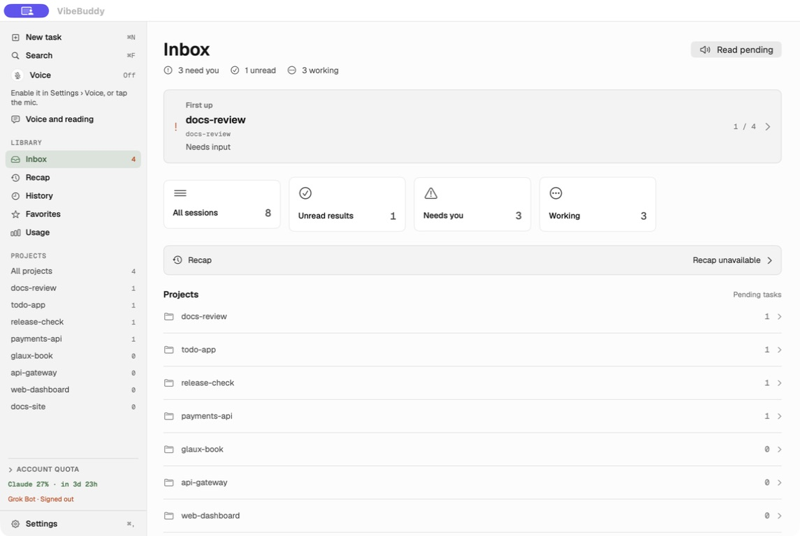
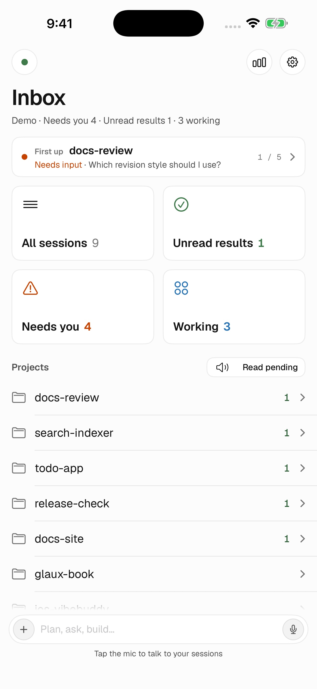
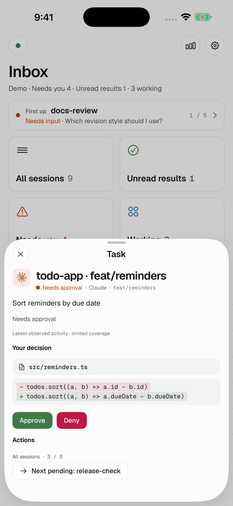
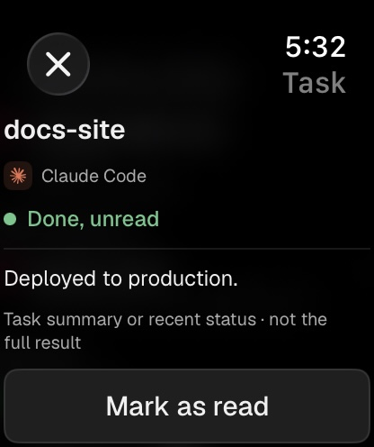
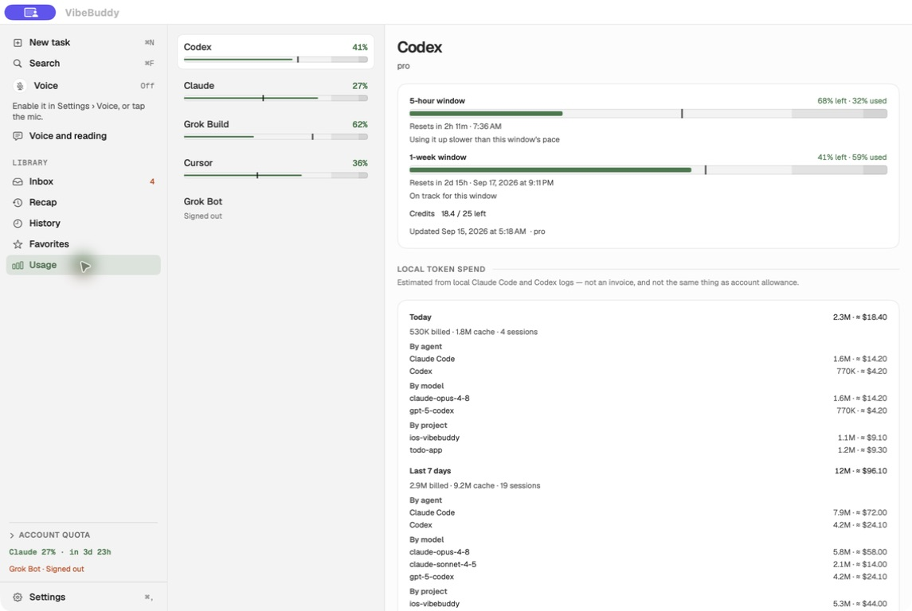
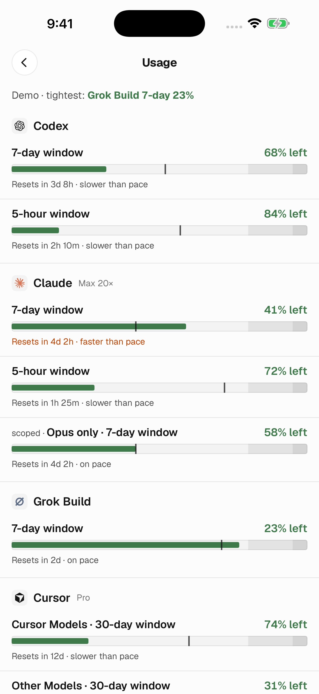
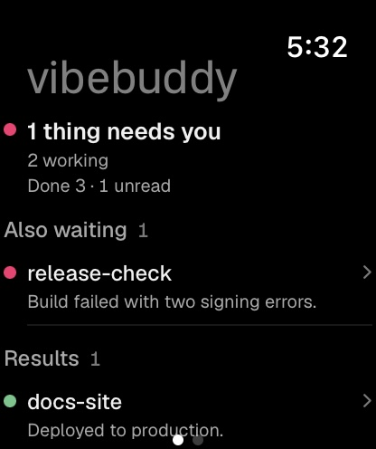
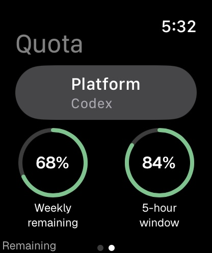
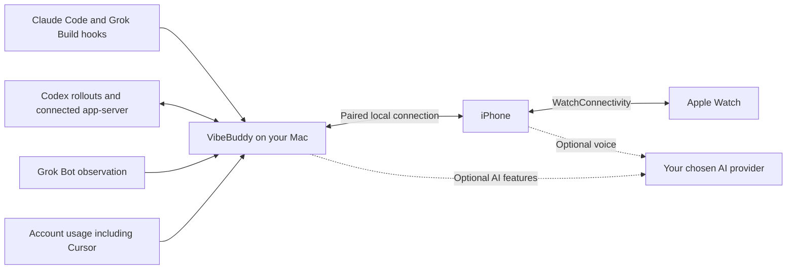

# vibebuddy

### Leave your desk. Keep your agents moving.

A native **Mac, iPhone & Apple Watch** companion for your AI workflow. **Claude Code · Codex · Grok Build · Grok Bot · Cursor** Follow tasks, review supported requests, and keep account usage in view.

[**Download for Mac**](https://github.com/semantic-craft/iOS-vibebuddy/releases/latest) · [**Get the iPhone app**](https://apps.apple.com/us/app/vibebuddy-agent-monitor/id6777469338) · [Get started](#get-started) · [Follow on X](https://x.com/mm87584) · [简体中文](README.zh-CN.md)

   

**Free & open source · No VibeBuddy account · No analytics · Bring your own AI key**

The actual Mac 1.3.19 interface in Demo mode. Tasks, projects and quota readings are sample data.

## A little less checking. A lot more doing.

Start a refactor in Claude Code, a test run in Codex and a build in Grok Build. Check a Grok Bot result and your remaining Cursor allowance from the same companion. While your Mac stays running and reachable, you can check a question on your phone, follow a task on your wrist, or ask the voice companion for an update.

| See what matters | Keep work moving | Hear the outcome |
| --- | --- | --- |
| **One task view.** Needs you, Unread results and Working, with project, model, current activity and available usage data. | **Approve and reply.** Review a command or bounded diff preview, answer a question, or continue a supported Codex task. | **Voice and summaries.** Ask for current task status, read a concise completion summary, or enable read-aloud on Mac. |

## Use Codex across your Apple devices

Follow Codex tasks and usage on Mac and iPhone, and check completion results on Apple Watch. A connected Codex app-server lets you create, continue, steer and stop the tasks it owns, and respond to supported approval requests and questions. Codex Desktop observation is also supported; its native approvals may still require the Mac.

Optional OpenAI voice conversation and read-aloud use your own API key. The repository includes the Swift integration code, protocol checks and documented limits. See [Codex and OpenAI workflows](docs/codex-openai-workflows.md) for setup, source links and a workflow you can try.

## Three screens. One companion.

<table>
<tr><th>iPhone Inbox</th><th>Task details</th><th>Watch results</th></tr>
<tr><td align="center" valign="top"></td><td align="center" valign="top"></td><td align="center" valign="top"></td></tr>
</table>

iPhone/Watch 1.3.17 (46), Mac 1.3.19 (31). Native Demo captures matching the submitted mobile store images and Mac release images; they do not represent live task results. <a href="docs/app-store-screenshots/1.3.17/README.md">Screenshot provenance</a>.

More screenshots: task list and usage across devices

<table>
<tr><td align="center" valign="top"></td><td align="center" valign="top"></td><td align="center" valign="top"></td></tr>
</table>

- **On Mac:** use Inbox for requests and unread results, browse by project, search and read session history, check usage, or hand off with Continue with…. The menu bar and notch keep compact status visible.
- **On iPhone:** Inbox, task details, recent dialogue and supported approvals and replies, plus Usage and home/lock-screen quota widgets. Pair from computer connection settings or the Home connection indicator.
- **On Apple Watch:** browse working tasks and unread results, open the matching task from a completion notification, refresh its summary and explicitly mark it read. Usage and complications remain available. A paired iPhone is required; system settings govern notifications and background refresh.

## Recent major updates

| Feature | What changed |
| --- | --- |
| **Inbox and session reading** | Separate requests, unread results and working tasks. The Mac reader supports live updates, search navigation and export. Opening a detail does not mark it read. [1.3.17](docs/release-notes-1.3.17.md) |
| **From wrist notification to task** | Open the matching detail and request its latest result while the iPhone is locked. Failed refreshes identify cached content and offer Retry. Watch Recap was removed; task lists and explicit read confirmation remain. [Watch update](docs/release-notes-1.3.17.md) |
| **Notifications and Quiet preferences** | Fixed reminders being suppressed just because the source app was frontmost. Followed completions support audible reminders while respecting notification and Quiet settings. [Notification update](docs/release-notes-1.3.17.md) |
| **Usage and quota widgets** | iPhone Usage and home/lock-screen widgets show each provider's reading, update age and unavailable state. Widget links open that provider. Widgets use the latest saved readings. [Usage update](docs/release-notes-1.3.17.md) |
| **Continue with another agent** | On Mac, choose Claude Code, Codex or Cursor, review the directory and handoff prompt, then start. Observed session directories and continuation links survive restarts; unknown directories are left for you to choose. [Handoff details](docs/release-notes-1.3.16.md) |
| **Menu bar and notch adaptation** | Recover off-screen menu bar placement. Compact status sits beside the camera at the current display's notch height, with content-sized sides and no model-specific configuration. [Menu bar](docs/release-notes-1.3.18.md) · [Notch](docs/release-notes-1.3.19.md) |
| **Voice, summaries and read-aloud** | Configure optional voice conversation, completion summaries and Mac read-aloud separately, using supported providers including OpenAI, Gemini, Qwen and Doubao. [Voice settings](docs/release-notes-1.3.11.md) |

This page presents Mac 1.3.19 and iPhone/Watch 1.3.17 features. Mobile 1.3.17 (46) was submitted to App Review on 2026-09-15; submission does not mean approval or public availability. Check [Mac Releases](https://github.com/semantic-craft/iOS-vibebuddy/releases) and the [App Store listing](https://apps.apple.com/us/app/vibebuddy-agent-monitor/id6777469338) for downloadable versions.

## Your tools, connected

VibeBuddy connects to the agents you already run. Available controls follow the actual connection and pending request.

| Connection | Available integration | Where the boundary is |
| --- | --- | --- |
| **Claude Code** | Lifecycle hooks, task state, usage, permission decisions and answers to supported questions. | Remote responses need the approval hooks. When the native prompt owns the interaction, respond on Mac. |
| **Codex CLI / connected app-server** | Task state, usage, supported approvals and questions; create, continue, steer and stop tasks through a connected app-server. | Task control requires the connected server to own the task and expose the required turn/request. MCP elicitation is read-only. |
| **Codex Desktop** | Observe local task progress and completions; jump back to the app. | Desktop may own a separate app-server. Native Desktop approval coverage is incomplete; use the Mac prompt when no answerable request is available. |
| **Grok Build** | CLI lifecycle hooks, task state, account usage and configured approval gates. | Whether a remote approval resolves the native prompt depends on Grok's permission mode. |
| **Grok Bot** | Optional read-only task observation, summaries of verified ordinary completions and separate account usage. | Replies and approvals stay in the official app. Question continuations, automated tasks and turns spanning a disconnect are not yet supported. |
| **Cursor** | Task state for the Agent panel and the Cursor CLI, supported approvals and questions, queued follow-ups for a running turn, continuation of a finished chat through the Cursor CLI, and account usage with separate **Cursor Models** and **Other Models** pools. | Task state and remote responses need the Cursor hooks; without them the agent transcript still reports progress. Cursor exposes no way to interrupt a running turn, and no link that opens a specific chat — a jump brings Cursor forward. |

See the [Codex integration contract](docs/codex-integration.md) and [agent hook setup](docs/multi-cli-hook-setup.md). Qwen, Kimi, OpenCode and Antigravity coding-agent adapters are experimental community integrations; their verification is separate from Qwen's supported voice-provider integration.

## Get started

1. **Install the Mac companion.** [Download the latest DMG](https://github.com/semantic-craft/iOS-vibebuddy/releases/latest), drag the app into Applications, and launch it. The distributed Mac app requires Apple Silicon and macOS 14+.
2. **Connect your coding agent.** Open Setup in Mac settings and follow the agent-specific instructions. [Manual setup](docs/getting-started.md#connect-an-agent) is also available.
3. **Add your iPhone.** Install [VibeBuddy: Agent Monitor](https://apps.apple.com/us/app/vibebuddy-agent-monitor/id6777469338), choose **Pair a phone** on Mac, then open computer connection settings → **Scan to pair** on iPhone, or tap its Home connection indicator. Start on the same trusted local network. iPhone requires iOS 17+; the current Watch companion requires watchOS 26.5+.
4. **Try your workflow.** Run a short task in Claude Code, Codex or Grok Build and follow it until completion. You can also [enable Grok Bot observation](docs/getting-started.md#grok-bot) or [connect Cursor usage](docs/getting-started.md#cursor). Enable voice or summaries separately if you want them.

**Just looking?** The iPhone connection screen includes **See the demo (no Mac needed)**. Mac works on its own, too. App Store availability varies by region; [build from source](docs/getting-started.md#build-from-source) if needed.

### Voice is optional

Choose **OpenAI, Google Gemini, Alibaba Qwen or Volcengine Doubao**, add your own API credential in the app, review the disclosure and explicitly start a call. Ask “Which task needs me?” or give a clear response to an answerable request. Voice conversation, completion summaries and Mac read-aloud are configured independently. Provider charges apply; task monitoring and button approvals need no AI API key.

### Notifications follow your setup

Live Activity and Dynamic Island counts update while the phone is connected. Closed-app push requires a running Mac, matching APNs signing configuration, a registered phone and notification permission. **Public downloads do not yet include turnkey closed-app push setup**; see the [APNs setup](docs/apns-setup.md) and [distribution decision](docs/adr/0013-apns-key-delivery.md). Actions always require a reachable paired Mac. Focus, notification settings and watchOS scheduling affect what appears.

## Your Mac is the hub

There is **no VibeBuddy cloud, account or analytics service**. Mac and phone communicate over your network with bearer-token authentication. Optional AI features send the required audio or task text directly to the provider you choose; configured push notifications pass through Apple. Voice credentials are stored in Keychain. [Privacy policy](docs/privacy-policy.md).

## Open source, all the way down

The Mac app, iPhone app, Watch companion, daemon, shared Swift models and agent hooks are all in this MIT-licensed repository. The integrations and their limits are documented so other developers can inspect, reproduce and improve them.

| Explore | Start here |
| --- | --- |
| Build and run | [Developer setup](docs/getting-started.md#build-from-source) |
| Shared models and voice adapters | [VibeBuddyKit](VibeBuddyKit/Sources/VibeBuddyKit) |
| Agent observation and local server | [VibeBuddyMacCore](VibeBuddyMac/Sources/VibeBuddyMacCore) |
| Native apps | [Mac](VibeBuddyMacApp/Sources) · [iPhone](VibeBuddyApp/Sources) · [Watch](VibeBuddyApp/Watch) |
| Protocol checks and design decisions | [Codex probes](tools/codex-integration/README.md) · [Architecture decisions](docs/adr) |
| Maintenance history | [Releases](https://github.com/semantic-craft/iOS-vibebuddy/releases) · [Merged pull requests](https://github.com/semantic-craft/iOS-vibebuddy/pulls?q=is%3Apr+is%3Amerged) |

**Contributions are welcome.** Reproduce an integration issue, improve a translation, document a device workflow or submit a focused fix. Start with [CONTRIBUTING.md](CONTRIBUTING.md). If VibeBuddy helps your workflow, a star or a concrete account of how you use it helps others discover the project.

## Author

Built by [Semantic_Craft (@mm87584)](https://x.com/mm87584). Follow on X for VibeBuddy updates and conversations about using AI tools.

## Acknowledgements

[m5-paper-buddy](https://github.com/op7418/m5-paper-buddy) inspired the hook-and-transcript approach to agent status; [open-vibe-island](https://github.com/Octane0411/open-vibe-island) informed the multi-agent model and Mac Glance. VibeBuddy's Swift implementation was written independently. The app icon was developed with the [ip-as-logo skill](https://github.com/s1dashu/ip-as-logo-skill); the in-app cat is drawn in shared Swift code.

[MIT](LICENSE). An independent community project; not affiliated with or endorsed by Anthropic, OpenAI or Apple.

For access away from your LAN, see [Tailscale remote setup](docs/getting-started.md#remote-access-with-tailscale).
