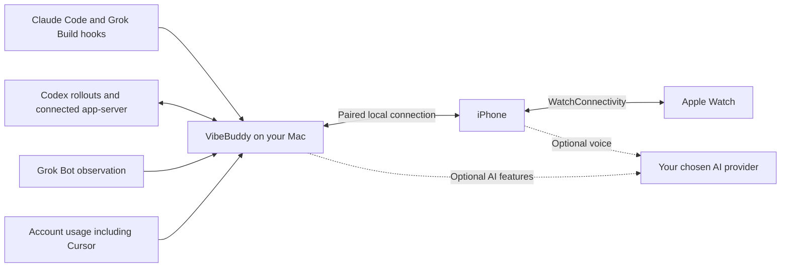

# vibebuddy

### Leave your desk. Keep your agents moving.

A native **Mac, iPhone & Apple Watch** companion for your AI workflow. **Claude Code · Codex · Grok Build · Grok Bot · Cursor** Follow tasks, review supported requests, and keep account usage in view.

[**Download for Mac**](https://github.com/semantic-craft/iOS-vibebuddy/releases/latest) · [**Get the iPhone app**](https://apps.apple.com/us/app/vibebuddy-agent-monitor/id6777469338) · [Get started](#get-started) · [简体中文](README.zh-CN.md)

   

**Free & open source · No VibeBuddy account · No analytics · Bring your own AI key**

Real app, sample tasks: the 1.3 demo dashboard. Screenshots illustrate the interface, not live agent results.

## A little less checking. A lot more doing.

Start a refactor in Claude Code, a test run in Codex and a build in Grok Build. Check a Grok Bot result and your remaining Cursor allowance from the same companion. While your Mac stays running and reachable, you can check a question on your phone, follow a task on your wrist, or ask the voice companion for an update.

| See what matters | Keep work moving | Hear the outcome |
| --- | --- | --- |
| **One task view.** Needs response, Working and Done, with project, model, current activity and available usage data. | **Approve and reply.** Review a command or bounded diff preview, answer a question, or continue a supported Codex task. | **Voice and summaries.** Ask for current task status, read a concise completion summary, or enable read-aloud on Mac. |

## Three screens. One companion.

<table>
<tr>
<th>Review on iPhone</th>
<th>Open the task details</th>
<th>Glance at your wrist</th>
</tr>
<tr>
<td align="center" valign="top"></td>
<td align="center" valign="top"></td>
<td align="center" valign="top">  Followed tasks Quick answers Completion summaries Quota at a glance</td>
</tr>
</table>

Captured from the actual 1.3 apps in Demo mode. Watch image shows the in-app quota page. <a href="docs/app-store-screenshots/1.3/README.md">Screenshot provenance</a>.

- **On Mac:** a searchable menu-bar activity feed, full dashboard, notch Glance and jump back to the originating terminal or app.
- **On iPhone:** task details, recent dialogue, supported approvals and replies, Live Activity and Dynamic Island counts.
- **On Apple Watch:** followed tasks, quick answers, completion summaries, task and quota complications, and Smart Stack relevance. A paired iPhone is required; watchOS controls background refresh.

## New in the 1.3 series

| Feature | What changed |
| --- | --- |
| **Talk to your tasks** | [1.3.11](https://github.com/semantic-craft/iOS-vibebuddy/releases/tag/v1.3.11) adds GPT-Live 1 with a separately configurable task reasoning model. OpenAI, Gemini, Qwen and Doubao share task-status and supported action tools. |
| **Get a useful completion update** | Optional AI summaries focus on results, blockers and next steps. Mac read-aloud has its own provider, model and voice, with voice previews. [Model settings](docs/release-notes-1.3.10.md). |
| **Continue the conversation** | Reply to supported waits, steer a running Codex turn or continue an existing task. Recent dialogue and delivery receipts help you see what was sent. [Task interaction](docs/release-notes-1.3.6.md). |
| **Keep the Mac close at hand** | Search and filter the menu feed, open task details, and use an explicitly opened QR pairing window. [Mac companion update](docs/release-notes-1.3.9.md). |
| **Follow work on your wrist** | Watch quick answers, task controls and completion summaries keep followed tasks close at hand. [Watch update](docs/release-notes-1.3.8.md). |
| **Follow Grok Build and Grok Bot** | Track Build CLI tasks, account usage and mode-dependent approval requests. Enable read-only Bot observation, summaries of verified ordinary completions and its separate account quota. [Grok Build setup](docs/getting-started.md#grok-build) · [Grok Bot update](docs/release-notes-1.3.7.md). |
| **Keep Cursor usage in view** | Read allowance from an existing Cursor app or Cursor CLI login, with separate **Cursor Models** and **Other Models** pools. [Cursor CLI support](docs/release-notes-1.3.2.md). |

Mac releases and iPhone/Watch App Store updates ship independently. Newer features need an updated client on the device using them. Check the [Mac releases](https://github.com/semantic-craft/iOS-vibebuddy/releases) and [App Store listing](https://apps.apple.com/us/app/vibebuddy-agent-monitor/id6777469338) for current versions and availability.

## Your tools, connected

VibeBuddy connects to the agents you already run. Available controls follow the actual connection and pending request.

| Connection | Available integration | Where the boundary is |
| --- | --- | --- |
| **Claude Code** | Lifecycle hooks, task state, usage, permission decisions and answers to supported questions. | Remote responses need the approval hooks. When the native prompt owns the interaction, respond on Mac. |
| **Codex CLI / connected app-server** | Task state, usage, supported approvals and questions; create, continue, steer and stop tasks through a connected app-server. | Task control requires the connected server to own the task and expose the required turn/request. MCP elicitation is read-only. |
| **Codex Desktop** | Observe local task progress and completions; jump back to the app. | Desktop may own a separate app-server. Native Desktop approval coverage is incomplete; use the Mac prompt when no answerable request is available. |
| **Grok Build** | CLI lifecycle hooks, task state, account usage and configured approval gates. | Whether a remote approval resolves the native prompt depends on Grok's permission mode. |
| **Grok Bot** | Optional read-only task observation, summaries of verified ordinary completions and separate account usage. | Replies and approvals stay in the official app. Question continuations, automated tasks and turns spanning a disconnect are not yet supported. |
| **Cursor** | Account usage from supported login sources, including the Cursor app and Cursor CLI, with separate **Cursor Models** and **Other Models** pools. | Quota integration is available; task tracking and remote approval are not yet supported. |

See the [Codex integration contract](docs/codex-integration.md) and [agent hook setup](docs/multi-cli-hook-setup.md). Qwen, Kimi, OpenCode and Antigravity coding-agent adapters are experimental community integrations; their verification is separate from Qwen's supported voice-provider integration.

## Get started

1. **Install the Mac companion.** [Download the latest DMG](https://github.com/semantic-craft/iOS-vibebuddy/releases/latest), drag the app into Applications, and launch it. The distributed Mac app requires Apple Silicon and macOS 14+.
2. **Connect your coding agent.** Open Setup in Mac settings and follow the agent-specific instructions. [Manual setup](docs/getting-started.md#connect-an-agent) is also available.
3. **Add your iPhone.** Install [VibeBuddy: Agent Monitor](https://apps.apple.com/us/app/vibebuddy-agent-monitor/id6777469338), choose **Pair a phone** on Mac, then **Scan to pair** on iPhone. Start on the same trusted local network. iPhone requires iOS 17+; the current Watch companion requires watchOS 26.5+.
4. **Try your workflow.** Run a short task in Claude Code, Codex or Grok Build and follow it until completion. You can also [enable Grok Bot observation](docs/getting-started.md#grok-bot) or [connect Cursor usage](docs/getting-started.md#cursor). Enable voice or summaries separately if you want them.

**Just looking?** The iPhone connection screen includes **See the demo (no Mac needed)**. Mac works on its own, too. App Store availability varies by region; [build from source](docs/getting-started.md#build-from-source) if needed.

### Voice is optional

Choose **OpenAI, Google Gemini, Alibaba Qwen or Volcengine Doubao**, add your own API credential in the app, review the disclosure and explicitly start a call. Ask “Which task needs me?” or give a clear response to an answerable request. Voice conversation, completion summaries and Mac read-aloud are configured independently. Provider charges apply; task monitoring and button approvals need no AI API key.

### Notifications follow your setup

Live Activity and Dynamic Island counts update while the phone is connected. Closed-app push requires a running Mac, matching APNs signing configuration, a registered phone and notification permission. **Public downloads do not yet include turnkey closed-app push setup**; see the [APNs setup](docs/apns-setup.md) and [distribution decision](docs/adr/0013-apns-key-delivery.md). Actions always require a reachable paired Mac. Focus, notification settings and watchOS scheduling affect what appears.

## Your Mac is the hub

There is **no VibeBuddy cloud, account or analytics service**. Mac and phone communicate over your network with bearer-token authentication. Optional AI features send the required audio or task text directly to the provider you choose; configured push notifications pass through Apple. Voice credentials are stored in Keychain. [Privacy policy](docs/privacy-policy.md).

## Open source, all the way down

The Mac app, iPhone app, Watch companion, daemon, shared Swift models and agent hooks are all in this MIT-licensed repository. The integrations and their limits are documented so other developers can inspect, reproduce and improve them.

| Explore | Start here |
| --- | --- |
| Build and run | [Developer setup](docs/getting-started.md#build-from-source) |
| Shared models and voice adapters | [VibeBuddyKit](VibeBuddyKit/Sources/VibeBuddyKit) |
| Agent observation and local server | [VibeBuddyMacCore](VibeBuddyMac/Sources/VibeBuddyMacCore) |
| Native apps | [Mac](VibeBuddyMacApp/Sources) · [iPhone](VibeBuddyApp/Sources) · [Watch](VibeBuddyApp/Watch) |
| Protocol checks and design decisions | [Codex probes](tools/codex-integration/README.md) · [Architecture decisions](docs/adr) |
| Maintenance history | [Releases](https://github.com/semantic-craft/iOS-vibebuddy/releases) · [Merged pull requests](https://github.com/semantic-craft/iOS-vibebuddy/pulls?q=is%3Apr+is%3Amerged) |

**Contributions are welcome.** Reproduce an integration issue, improve a translation, document a device workflow or submit a focused fix. Start with [CONTRIBUTING.md](CONTRIBUTING.md). If VibeBuddy helps your workflow, a star or a concrete account of how you use it helps others discover the project.

## Acknowledgements

[m5-paper-buddy](https://github.com/op7418/m5-paper-buddy) inspired the hook-and-transcript approach to agent status; [open-vibe-island](https://github.com/Octane0411/open-vibe-island) informed the multi-agent model and Mac Glance. VibeBuddy's Swift implementation was written independently. The app icon was developed with the [ip-as-logo skill](https://github.com/s1dashu/ip-as-logo-skill); the in-app cat is drawn in shared Swift code.

[MIT](LICENSE) © 2026 Xianwei Zhang. An independent community project; not affiliated with or endorsed by Anthropic, OpenAI or Apple.
