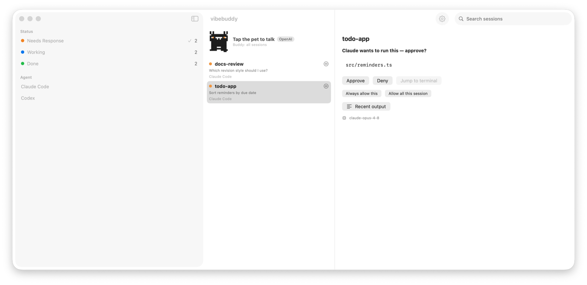

<div align="center">


# vibebuddy

**Your AI coding agents — on your phone.**
Glance at every session, get pinged the moment one needs you, approve the exact command from your lock screen — or just **talk to your agents out loud**.

[**⬇️ Download for macOS**](https://github.com/semantic-craft/iOS-vibebuddy/releases/latest) · [Features](#-features) · [How it works](#-how-it-works) · [Build from source](#️-build--run) · [简体中文](./README.zh-CN.md)


[](https://github.com/semantic-craft/iOS-vibebuddy/releases/latest)

</div>

---

## 🐱 The 30-second pitch

You kick off three Claude Code sessions, switch to Codex for a fourth, walk away to make coffee — and now you have no idea which agent is stuck waiting on you, which is still grinding, and which already finished and is sitting idle.

**vibebuddy** is a tiny menu-bar cat on your Mac plus a companion app on your iPhone. It watches every coding-agent session and answers the only three questions that matter:

> ### 🟠 Needs response · 🔵 Working · 🟢 Done

No more walking back to the desk to find a session has been blocked on a permission prompt for ten minutes. Your phone buzzes, you read the exact diff, and you tap **Approve** — or you tap the cat and **say "approve it."**

<div align="center">



<sub><b>The Mac menu-bar app</b> — every session in three buckets, the voice pet, and a remote-approval detail pane.</sub>

<br><br>


<sub><b>Always-on notch glance</b> — the same cat + live 🟠 / 🔵 / 🟢 counts.</sub>

<br><br>


<sub><b>On your iPhone</b> — tap a session for the inline diff and Approve / Deny.</sub>

</div>

> The buddy is **one cat, drawn in code, identical on iPhone, the Mac dashboard, and the notch glance** — only its mood (eyes & ears) and color (white on the dark notch) change. All screenshots above are **Demo mode** (sample data) — no real session data.

---

## ✨ Features

### 🎙️ Talk to your agents — voice companion
The part nobody else has. Tap the cat and start a **real-time voice conversation** with your running agents. Ask "what's the payments session waiting on?", and **approve, deny, or answer a prompt by voice** — it acts through structured function calling, not screen-scraping. Runs on **your own AI key** (OpenAI, Google Gemini, or Alibaba DashScope / Qwen), stays **completely off until you add a key**, recognizes speech **on-device**, speaks fluent 中文 (Aoede voice), and is hard-wired to **refuse to leak the agent's system prompt**.

### 📊 The three-bucket dashboard
Every session grouped into **Needs response / Working / Done**, each row showing project · branch · model · live token & context-window usage · the tool the agent is currently running · and a peek at its most recent output. Priority is honest: `needs response` always outranks `working`.

### ✅ Remote approvals
When an agent asks to run a command or edit a file, the **full command or diff** lands on your phone. **Approve / Deny**, or **Always allow this** / **Allow all this session** — straight from the dashboard or the lock screen.

### 🔔 Notifications, Live Activity & Dynamic Island
A banner the instant a session needs you. Live counts ride along on the **Lock Screen and Dynamic Island** via ActivityKit, kept fresh with **APNs push** even when the app is closed.

### 🤖 Works across your whole agent fleet
Source-agnostic from day one. **Claude Code and Codex** are tested end-to-end; adapters ship for **Qwen, Kimi, Grok, OpenCode, and Gemini (Antigravity)**. One universal hook installer wires them all up.

### 📷 QR pairing, zero typing
The Mac shows a QR encoding `host:port` + a bearer token. The phone scans it once — no manual IP entry. (The same QR can carry a Tailscale `100.x` address later, with no code change.)

### 🖥️ Native Mac menu-bar app
A `MenuBarExtra` glance with live counts, a macOS notch glance, **jump-to-terminal** (open the right session with one click), launch-at-login, a Keychain-stored token, and Sparkle auto-update. ⏎ / ⌘F dashboard shortcuts included.

### 🔒 Local-first & private by design
vibebuddy talks **directly** between your Mac and your phone over your own network. Session data **never** touches a vibebuddy server — there is no vibebuddy cloud, no account, no analytics, no tracking. Daemon routes are bearer-token gated. (The optional voice companion sends microphone audio and selected session context only to the provider *you* chose, with *your* key, when you turn it on.)

### 🌏 Bilingual + Demo mode
Full English and Simplified-Chinese UI on both apps. Plus a **Demo mode** that loads the whole interface with sample data — explore everything with no Mac required.

---

## ⬇️ Download

### macOS app
**[Download vibebuddy-mac-v1.0.dmg →](https://github.com/semantic-craft/iOS-vibebuddy/releases/latest)** · Apple Silicon · macOS 14+

> **First launch (unsigned build).** This early build isn't notarized yet, so Gatekeeper will warn the first time. Open the `.dmg`, drag **vibebuddy** to **Applications**, then either **right-click → Open → Open**, or run once:
> ```bash
> xattr -dr com.apple.quarantine /Applications/vibebuddy.app
> ```
> The current public build is unsigned. A signed + notarized (double-click-to-open, zero-warning) build is not in this release.

### iPhone app
Build it from source for now — see [Build & run](#️-build--run). Install on your own iPhone; there is no public iPhone download.

---

## 🧠 How it works

```
Claude Code / Codex / Qwen / … ──hooks──▶ vibebuddy (macOS menu-bar app)
                                          • reduce hooks → needsResponse / working / done
                                          • parse JSONL transcript → model / tokens / summary
                                          • serve over LAN  (HTTP /snapshot, WebSocket /ws)
                                                  │  scan QR to pair (host:port + token)
                                                  ▼
                                          vibebuddy (iPhone, SwiftUI)
                                          • 3-bucket dashboard + Live Activity
                                          • notify + remote approve + voice companion
                  shared VibeBuddyKit — one Codable wire model, written once
```

The hard part — *detecting* session state — is solved by **hooks** that each agent CLI fires on its lifecycle events (`UserPromptSubmit`, `PreToolUse`, `Notification`, `Stop`, …). vibebuddy reduces them to the three states and broadcasts a token-gated snapshot. The hooks **fail open**: if vibebuddy isn't running, your agents are completely unaffected.

---

## 🛠️ Build & run

| Path | What |
|------|------|
| `VibeBuddyKit/` | Shared Codable wire model (SwiftPM) |
| `VibeBuddyMac/` | macOS core lib + `vibebuddyd` headless CLI (SwiftPM) |
| `VibeBuddyMacApp/` | macOS menu-bar app (xcodegen) — Keychain token, launch-at-login, Sparkle |
| `VibeBuddyApp/` | iOS app (xcodegen) |
| `docs/planning/` | overview, PRD, architecture, roadmap, prior-art |

**Mac side (menu-bar app):**
```bash
cd VibeBuddyMacApp && xcodegen generate
open VibeBuddyMacApp.xcodeproj   # build & run (⌘R)
```
A menu-bar-only app: live counts, a "Pair a phone" QR, and launch-at-login; the LAN token lives in the Keychain. (`vibebuddyd` in `VibeBuddyMac/` is the headless equivalent: `swift run vibebuddyd`.)

**iOS app:**
```bash
cd VibeBuddyApp && xcodegen generate
open VibeBuddyApp.xcodeproj   # run on a Simulator/device
```
Pair by scanning the QR, or enter host/port/token manually. (Simulator: use `127.0.0.1` and the token from `~/Library/Application Support/vibebuddy/token`.)

**Hooks (feed real agent sessions):**
```bash
python3 hooks/install-claude-hooks.py --dry-run    # preview
python3 hooks/install-claude-hooks.py --install    # back up + install
python3 hooks/install-claude-hooks.py --uninstall  # revert
```
Installs fail-open `curl` POSTs for each lifecycle event. See [`docs/multi-cli-hook-setup.md`](docs/multi-cli-hook-setup.md) for every supported CLI.

**Tests:**
```bash
cd VibeBuddyKit && swift test     # wire-model tests
cd VibeBuddyMac && swift test     # daemon / reducer / transcript tests
```

---

## 💡 Inspired by

vibebuddy stands on the shoulders of two clever projects that first proved you can *detect* coding-agent state from hooks and a transcript tail — we re-pointed that idea at a phone (and added two-way voice). We **studied their architecture and wrote our own Swift**; no code was copied.

- **[op7418/m5-paper-buddy](https://github.com/op7418/m5-paper-buddy)** — showed your agent's RUNNING / WAITING status on an **M5Paper e-ink gadget** via transcript-tail JSONL parsing and fail-open hook `curl`. vibebuddy borrows the detection concept and moves the display from a desk gadget to your pocket.
- **[Octane0411/open-vibe-island](https://github.com/Octane0411/open-vibe-island)** — a source-agnostic `SessionState` reducer across 10+ agents, surfaced in the **macOS menu bar / notch**. It shaped vibebuddy's multi-agent model and Mac-side glance.

---

## 📍 Status

The public Mac release is **[v1.0](https://github.com/semantic-craft/iOS-vibebuddy/releases/tag/v1.0)**. v1 core is complete and verified end-to-end: 3-bucket dashboard, QR pairing, notifications, remote approvals, Live Activity / Dynamic Island, the voice companion, and multi-CLI hooks (Claude Code + Codex tested). iPhone and Watch are installed from Xcode onto personal devices. See [`docs/planning/roadmap.md`](docs/planning/roadmap.md).

## 📄 License

[MIT](./LICENSE) © 2026 Xianwei Zhang
