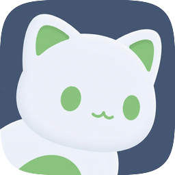
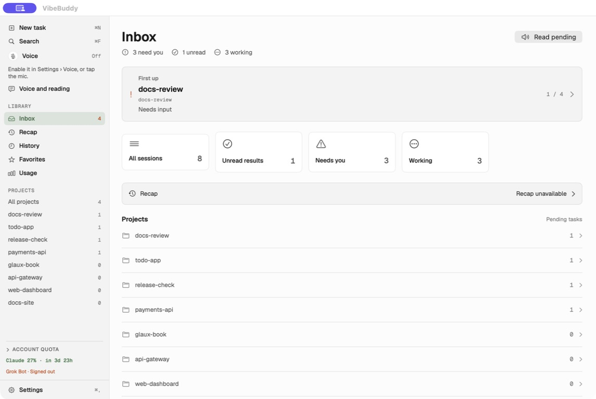
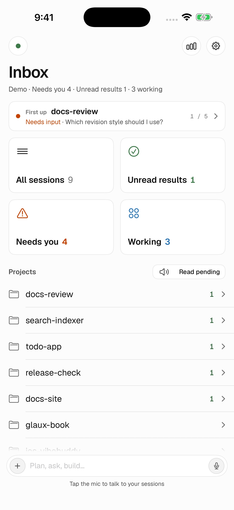
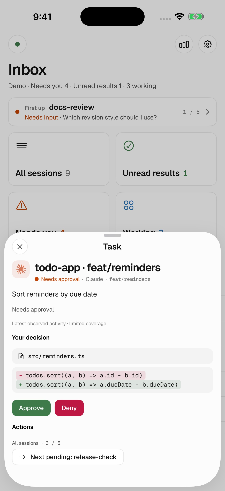
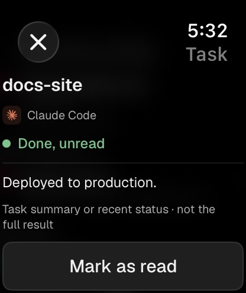
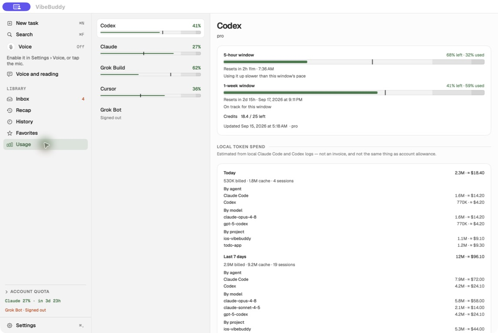
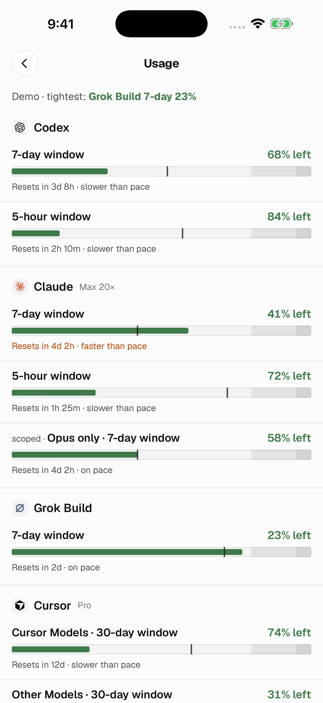
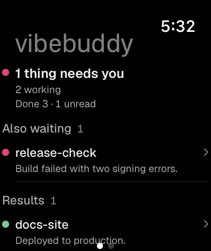
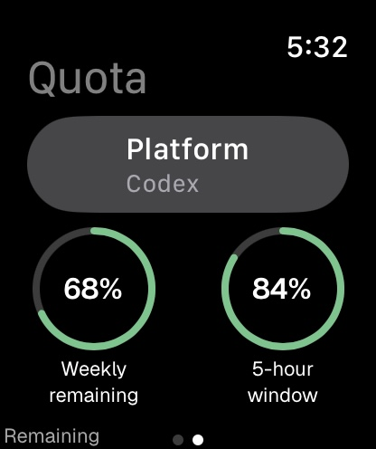
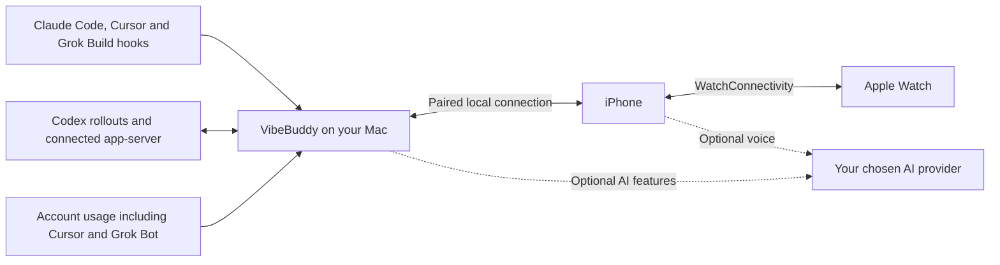

<div align="center">



# vibebuddy

### Leave your desk. Keep your agents moving.

A native **Mac, iPhone & Apple Watch** companion for your AI workflow.<br>**Claude Code · Codex · Grok Build · Cursor**<br>Follow tasks, review supported requests, and keep account usage in view.

[**Download for Mac**](https://github.com/semantic-craft/iOS-vibebuddy/releases/latest) · [**Get the iPhone app**](https://apps.apple.com/us/app/vibebuddy-agent-monitor/id6777469338) · [Get started](#get-started) · [Follow on X](https://x.com/mm87584) · [简体中文](README.zh-CN.md)

[](https://github.com/semantic-craft/iOS-vibebuddy/releases/latest) [](LICENSE)  

**Free & open source · No VibeBuddy account · No analytics · Bring your own AI key**



<sub>The actual Mac 1.3.19 interface in Demo mode. Tasks, projects and quota readings are sample data.</sub>

</div>

## Highlights

- **Task inbox** — requests that need you, unread results and working tasks, with the project, agent, model and current activity in view.
- **Approvals and replies** — review commands and bounded diff previews on Mac or iPhone, then answer supported permission requests and questions. Available controls depend on the agent and connection.
- **Read and continue sessions** — read, search and export conversations on Mac. Use Continue with… to review a working directory and handoff prompt before continuing with Claude Code, Codex or Cursor.
- **Usage across devices** — check supported account allowances, with saved readings in iPhone home/lock-screen widgets and Watch complications.
- **Results on your wrist** — open the matching task from a completion notification, refresh its summary and explicitly mark it read. Apple Watch connects through its paired iPhone.
- **Menu bar and notch** — keep compact task status visible on Mac and open the full Inbox when you need it.
- **Optional voice and summaries** — configure voice conversation, completion summaries and read-aloud separately with your own provider credentials. Monitoring and button approvals need no AI API key.

## Three screens. One companion.

<table>
<tr><th>iPhone Inbox</th><th>Task details</th><th>Watch results</th></tr>
<tr><td align="center" valign="top"></td><td align="center" valign="top"></td><td align="center" valign="top"></td></tr>
</table>

<sub>iPhone/Watch 1.3.17 (46), Mac 1.3.19 (31). Native Demo captures matching the submitted mobile store images and Mac release images; they do not represent live task results. <a href="docs/app-store-screenshots/1.3.17/README.md">Screenshot provenance</a>.</sub>

<details>
<summary>More screenshots: task list and usage across devices</summary>



<table>
<tr><td align="center" valign="top"></td><td align="center" valign="top"></td><td align="center" valign="top"></td></tr>
</table>

</details>

- **On Mac:** use Inbox for requests and unread results, browse by project, read a live session's conversation, check usage, or hand off with Continue with…. The menu bar and notch keep compact status visible.
- **On iPhone:** Inbox, task details, recent dialogue and supported approvals and replies, plus Usage and home/lock-screen quota widgets. Pair from computer connection settings or the Home connection indicator.
- **On Apple Watch:** browse working tasks and unread results, open the matching task from a completion notification, refresh its summary and explicitly mark it read. Usage and complications remain available. A paired iPhone is required; system settings govern notifications and background refresh.

## Requirements

| Device | Requirement |
| --- | --- |
| Mac | The distributed app requires Apple Silicon and macOS 14 or later |
| iPhone | iOS 17 or later; live tasks and actions need a paired, running, reachable Mac |
| Apple Watch | The current companion requires watchOS 26.5 or later and a paired iPhone |
| Source builds | Xcode 26.6, Swift 6 and XcodeGen; device builds need your own signing team |

## Get started

1. **Install the Mac companion.** [Download the latest DMG](https://github.com/semantic-craft/iOS-vibebuddy/releases/latest), drag the app into Applications, and launch it. The distributed Mac app requires Apple Silicon and macOS 14+.
2. **Connect your coding agent.** Open Setup in Mac settings and follow the agent-specific instructions. [Manual setup](docs/getting-started.md#connect-an-agent-for-live-observation) is also available.
3. **Add your iPhone.** Install [VibeBuddy: Agent Monitor](https://apps.apple.com/us/app/vibebuddy-agent-monitor/id6777469338), choose **Pair a phone** on Mac, then open computer connection settings → **Scan to pair** on iPhone, or tap its Home connection indicator. Start on the same trusted local network. iPhone requires iOS 17+; the current Watch companion requires watchOS 26.5+.
4. **Try your workflow.** Run a short task in Claude Code, Codex or Grok Build and follow it until completion. You can also connect [Cursor](docs/getting-started.md#cursor) or [Grok Bot](docs/getting-started.md#grok-bot) usage. Enable voice or summaries separately if you want them.

**Just looking?** The iPhone connection screen includes **See the demo (no Mac needed)**. Mac works on its own, too. App Store availability varies by region; [build from source](docs/getting-started.md#build-from-source) if needed.

## Your tools, connected

VibeBuddy connects to the agents you already run. Available controls follow the actual connection and pending request.

| Connection | Available integration | Where the boundary is |
| --- | --- | --- |
| **Claude Code** | Lifecycle hooks, task state, usage, permission decisions and answers to supported questions. | Remote responses need the approval hooks. When the native prompt owns the interaction, respond on Mac. |
| **Codex CLI / connected app-server** | Task state, usage, supported approvals and questions; create, continue, steer and stop tasks through a connected app-server. | Task control requires the connected server to own the task and expose the required turn/request. Steering a running turn has not yet been verified end to end. MCP elicitation is read-only. |
| **Codex Desktop** | Observe local task progress and completions; jump back to the app. | Desktop may own a separate app-server. Native Desktop approval coverage is incomplete; use the Mac prompt when no answerable request is available. |
| **Grok Build** | CLI lifecycle hooks, task state, account usage and configured approval gates; tasks started from VibeBuddy are hosted over ACP with remote approval, questions, follow-ups and stop. | Tasks started from VibeBuddy follow Grok's `permission_mode`: under `always-approve` they never ask, so no approval reaches the phone. For a session opened in a terminal, a phone decision is authoritative only under `always-approve`. |
| **Grok Bot** | Account usage only. | There is no task integration: tasks, replies and approvals all stay in the official app. |
| **Cursor** | Task state for the Agent panel and the Cursor CLI, supported approvals and questions, queued follow-ups for a running turn, continuation of a finished chat through the Cursor CLI, and account usage with separate **Cursor Models** and **Other Models** pools. | Task state and remote responses need the Cursor hooks; without them the agent transcript still reports progress. Cursor exposes no way to interrupt a running turn, and no link that opens a specific chat — a jump brings Cursor forward. |

See the [Codex integration contract](docs/codex-integration.md) and [agent hook setup](docs/multi-cli-hook-setup.md). Qwen, Kimi, OpenCode and Antigravity coding-agent adapters are experimental community integrations; their verification is separate from Qwen's supported voice-provider integration.

## Voice and summaries

Choose **OpenAI, Alibaba Qwen or Volcengine Doubao**, add your own API credential in the app, review the disclosure and explicitly start a call. Ask “Which task needs me?” or give a clear response to an answerable request. Voice conversation, completion summaries and Mac read-aloud are configured independently. When a provider's per-call time limit ends a call, the app says so and offers a one-tap redial; the new call does not carry over the earlier conversation. Provider charges apply; task monitoring and button approvals need no AI API key.

## Known limitations

- **Your Mac must stay running and reachable.** Set up [Tailscale remote access](docs/getting-started.md#remote-access-with-tailscale) before connecting away from your LAN. Apple Watch still communicates through iPhone.
- **Remote controls vary by agent.** Observing a task does not grant access to its native approvals; some Codex Desktop requests still need the Mac. Steering a running Codex app-server turn has not yet been verified end to end.
- **Usage and widgets may show cached readings.** Check the update age and unavailable state. The operating system schedules widget and Watch background refreshes.

### Notifications and background operation

Live Activity and Dynamic Island counts update while the phone is connected. Closed-app push requires a running Mac, matching APNs signing configuration, a registered phone and notification permission. **Public downloads do not yet include turnkey closed-app push setup**; see the [APNs setup](docs/apns-setup.md) and [distribution decision](docs/adr/0013-apns-key-delivery.md). Actions always require a reachable paired Mac. Focus, notification settings and watchOS scheduling affect what appears.

## Privacy and connections


```mermaid
flowchart LR
    A[Claude Code, Cursor and Grok Build hooks] --> M[VibeBuddy on your Mac]
    C[Codex rollouts and connected app-server] <--> M
    U[Account usage including Cursor and Grok Bot] --> M
    M <-->|Paired local connection| P[iPhone]
    P <-->|WatchConnectivity| W[Apple Watch]
    M -. Optional AI features .-> V[Your chosen AI provider]
    P -. Optional voice .-> V
```

There is **no VibeBuddy cloud, account or analytics service**. Mac and phone communicate over your network with bearer-token authentication. Optional AI features send the required audio or task text directly to the provider you choose; configured push notifications pass through Apple. Voice credentials are stored in Keychain. [Privacy policy](docs/privacy-policy.md).

## Development and documentation

The Mac app, iPhone app, Watch companion, daemon, shared Swift models and agent hooks are all in this MIT-licensed repository. The integrations and their limits are documented so other developers can inspect, reproduce and improve them.

Generate the Mac project from a checkout:

```bash
git clone https://github.com/semantic-craft/iOS-vibebuddy.git
cd iOS-vibebuddy
xcodegen generate --spec VibeBuddyMacApp/project.yml
open VibeBuddyMacApp/VibeBuddyMacApp.xcodeproj
```

Build and run the `VibeBuddyMacApp` scheme in Xcode. See [source setup](docs/getting-started.md#build-from-source) for iPhone, Watch and signing. To check shared logic and the server:

```bash
swift test --package-path VibeBuddyKit
swift test --package-path VibeBuddyMac
```

| Explore | Start here |
| --- | --- |
| Build and run | [Developer setup](docs/getting-started.md#build-from-source) |
| Shared models and voice adapters | [VibeBuddyKit](VibeBuddyKit/Sources/VibeBuddyKit) |
| Agent observation and local server | [VibeBuddyMacCore](VibeBuddyMac/Sources/VibeBuddyMacCore) |
| Native apps | [Mac](VibeBuddyMacApp/Sources) · [iPhone](VibeBuddyApp/Sources) · [Watch](VibeBuddyApp/Watch) |
| Protocol checks and design decisions | [Codex probes](tools/codex-integration/README.md) · [Architecture decisions](docs/adr) |
| Codex and OpenAI workflows | [Setup and capabilities](docs/codex-openai-workflows.md) |
| Maintenance history | [Releases](https://github.com/semantic-craft/iOS-vibebuddy/releases) · [Merged pull requests](https://github.com/semantic-craft/iOS-vibebuddy/pulls?q=is%3Apr+is%3Amerged) |

**Contributions are welcome.** Reproduce an integration issue, improve a translation, document a device workflow or submit a focused fix. Start with [CONTRIBUTING.md](CONTRIBUTING.md). If VibeBuddy helps your workflow, a star or a concrete account of how you use it helps others discover the project.

## Author

Built by [Semantic_Craft (@mm87584)](https://x.com/mm87584). Follow on X for VibeBuddy updates and conversations about using AI tools.

## Acknowledgements

[m5-paper-buddy](https://github.com/op7418/m5-paper-buddy) inspired the hook-and-transcript approach to agent status; [open-vibe-island](https://github.com/Octane0411/open-vibe-island) informed the multi-agent model and Mac Glance. VibeBuddy's Swift implementation was written independently. The app icon was developed with the [ip-as-logo skill](https://github.com/s1dashu/ip-as-logo-skill); the in-app cat is drawn in shared Swift code.

## License

[MIT](LICENSE). An independent community project; not affiliated with or endorsed by Anthropic, OpenAI or Apple.
