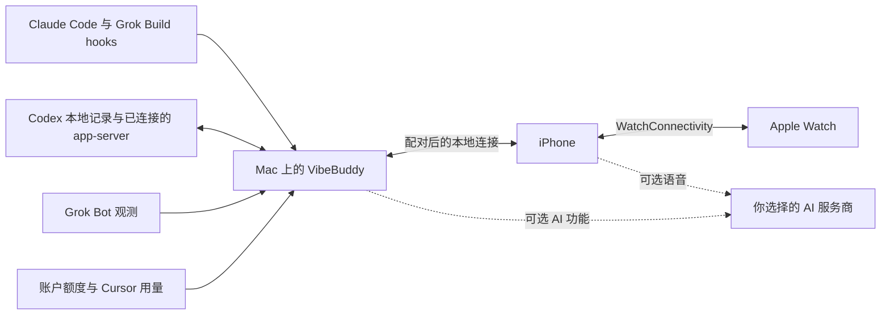

# vibebuddy

### 离开书桌，也能接着推进任务。

陪你使用 AI 工具的 **Mac、iPhone 与 Apple Watch** 原生伴侣。 **Claude Code · Codex · Grok Build · Grok Bot · Cursor** 关注任务进展，回应可处理的请求，随时查看账户额度。

[**下载 Mac 版**](https://github.com/semantic-craft/iOS-vibebuddy/releases/latest) · [**获取 iPhone 版**](https://apps.apple.com/us/app/vibebuddy-agent-monitor/id6777469338) · [开始使用](#开始使用) · [English](README.md)

   

**免费开源 · 无需 VibeBuddy 账号 · 无行为分析 · AI 功能使用自己的密钥**

真实 App 的 1.3 演示界面，使用样例任务。截图展示界面，不代表真实 Agent 的运行结果。

## 少来回查看，多做自己的事。

让 Claude Code 改代码、Codex 跑测试、Grok Build 执行构建，也能在同一个伴侣中查看 Grok Bot 的结果与 Cursor 剩余额度。只要 Mac 保持运行、网络可达，你就能在手机上处理问题，在手表上关注任务，或者开口询问最新进展。

| 看清当前情况 | 接着推进任务 | 了解完成结果 |
| --- | --- | --- |
| **统一任务视图。** 需要回应、进行中、已完成；查看项目、模型、当前活动与可获取的用量信息。 | **审批与回复。** 查看命令或有限行数的差异预览，回答问题，继续支持远程控制的 Codex 任务。 | **语音与摘要。** 询问当前任务状态，阅读简明的完成摘要，也可在 Mac 上开启朗读。 |

## 三块屏幕，同一个小伙伴。

<table>
<tr>
<th>在 iPhone 上处理请求</th>
<th>打开任务详情</th>
<th>抬腕查看额度</th>
</tr>
<tr>
<td align="center" valign="top"></td>
<td align="center" valign="top"></td>
<td align="center" valign="top">  关注中的任务 快捷回答 完成摘要 剩余额度</td>
</tr>
</table>

以上均来自实际运行的 1.3 App 演示模式。Watch 图片为 App 内额度页。<a href="docs/app-store-screenshots/1.3/README.md">截图来源说明</a>。

- **Mac：** 可搜索的菜单栏活动列表、完整任务看板、刘海 Glance，以及返回原终端或应用的快捷入口。
- **iPhone：** 任务详情、近期对话、支持的审批与回复、实时活动和灵动岛计数。
- **Apple Watch：** 关注任务、快捷回答、完成摘要、任务与额度表盘组件，以及智能叠放相关性提示。需要配对的 iPhone，后台刷新由 watchOS 调度。

## 1.3 系列带来了什么

| 新功能 | 具体变化 |
| --- | --- |
| **开口询问任务** | [1.3.11](https://github.com/semantic-craft/iOS-vibebuddy/releases/tag/v1.3.11) 接入 GPT-Live 1，可独立配置任务推理模型。OpenAI、Gemini、千问与豆包共用任务状态查询和受支持的操作工具。 |
| **听懂完成结果** | 可选 AI 摘要聚焦结果、阻塞与下一步。Mac 朗读可分别选择服务商、模型和音色，并先试听。[模型设置更新](docs/release-notes-1.3.10.md)。 |
| **继续已有对话** | 回答可处理的等待请求，为运行中的 Codex 任务补充指令，或继续已有任务；查看近期对话与发送回执。[任务交互更新](docs/release-notes-1.3.6.md)。 |
| **随手找到 Mac 上的任务** | 搜索和筛选菜单栏活动，打开任务详情，通过主动开启的二维码配对窗口连接手机。[Mac 伴侣更新](docs/release-notes-1.3.9.md)。 |
| **抬腕关注任务** | Watch 快捷回答、任务控制与完成摘要，方便随时查看关注中的任务。[Watch 更新](docs/release-notes-1.3.8.md)。 |
| **关注 Grok Build 与 Grok Bot** | 追踪 Build CLI 任务、账户额度与依权限模式提供的审批请求；可开启 Bot 只读观测、可核实的普通对话完成摘要与独立账户额度。[Grok Build 配置](docs/getting-started.md#grok-build) · [Grok Bot 更新](docs/release-notes-1.3.7.md)。 |
| **查看 Cursor 剩余额度** | 使用已有 Cursor App 或 Cursor CLI 登录，分别显示 **Cursor Models** 与 **Other Models** 两个额度池。[Cursor CLI 支持](docs/release-notes-1.3.2.md)。 |

Mac 版本与 iPhone／Watch 的 App Store 更新分别发布，新功能需要相应设备安装更新后的客户端。当前版本和可用情况以 [Mac Releases](https://github.com/semantic-craft/iOS-vibebuddy/releases) 和 [App Store 页面](https://apps.apple.com/us/app/vibebuddy-agent-monitor/id6777469338)为准。

## 常用工具与支持能力

VibeBuddy 连接你已经在用的 Agent。能否操作，取决于当前连接方式和具体请求。

| 连接方式 | 已有集成 | 能力范围 |
| --- | --- | --- |
| **Claude Code** | 生命周期 hooks、任务状态、用量、权限决定与受支持的问题回答。 | 远程回应需要安装审批 hooks；交互由原生提示处理时，回到 Mac 回应。 |
| **Codex CLI／已连接的 app-server** | 任务状态、额度、受支持的审批与问题；通过已连接的 app-server 新建、继续、补充指令和停止任务。 | 连接的服务必须拥有该任务，并能识别相应轮次或请求；MCP elicitation 目前只读。 |
| **Codex Desktop** | 观测本地任务进展和完成结果，跳回应用。 | Desktop 可能使用独立 app-server；原生审批覆盖不完整，没有可回应请求时需使用 Mac 提示。 |
| **Grok Build** | CLI 生命周期 hooks、任务状态、账户额度与配置后的审批通道。 | 远程批准能否解除原生提示，取决于 Grok 的权限模式。 |
| **Grok Bot** | 可选的只读任务观测、可核实的普通对话完成摘要与独立账户额度。 | 回复和审批在官方 App 中处理；问题续接、自动化任务及跨断线轮次尚未支持。 |
| **Cursor** | 从支持的登录来源读取账户额度，包括 Cursor App 与 Cursor CLI，分别显示 **Cursor Models** 和 **Other Models**。 | 已支持额度；尚不支持任务追踪和远程审批。 |

详见 [Codex 集成契约](docs/codex-integration.md)和 [Agent hook 配置](docs/multi-cli-hook-setup.md)。Qwen、Kimi、OpenCode、Antigravity 编码 Agent 适配器属于实验性社区集成；其验证状态与已支持的千问语音服务不同。

## 开始使用

1. **安装 Mac 伴侣。** [下载最新 DMG](https://github.com/semantic-craft/iOS-vibebuddy/releases/latest)，将 App 拖入“应用程序”并打开。发布的 Mac 版需要 Apple Silicon 与 macOS 14+。
2. **接入编码 Agent。** 在 Mac 设置的 Setup 中按对应 Agent 的说明配置，也可查看[手动配置指南](docs/getting-started.md#connect-an-agent)。
3. **连接 iPhone。** 安装 [VibeBuddy: Agent Monitor](https://apps.apple.com/us/app/vibebuddy-agent-monitor/id6777469338)，在 Mac 选择“配对手机”，在 iPhone 选择“扫码配对”。首次在同一可信局域网操作。iPhone 需要 iOS 17+，当前 Watch 伴侣需要 watchOS 26.5+。
4. **试试你的工作流。** 在 Claude Code、Codex 或 Grok Build 发起简短任务并关注至完成，也可[开启 Grok Bot 观测](docs/getting-started.md#grok-bot)或[接入 Cursor 额度](docs/getting-started.md#cursor)。语音和摘要可按需单独开启。

**想先看看界面？** iPhone 连接页有“查看演示（无需 Mac）”，Mac 也可独立使用。上述 App Store 链接指向美国商店，是否可下载取决于账号地区；也可[自行编译](docs/getting-started.md#build-from-source)。

### 语音按需开启

选择 **OpenAI、Google Gemini、阿里千问或火山引擎豆包**，在 App 内填写自己的 API 凭据、阅读告知后主动开始通话。可以询问“哪个任务需要我？”，也可以明确回答当前可处理的请求。实时对话、完成摘要和 Mac 朗读分别配置。服务商可能收费；任务看板和按钮审批不需要 AI API 密钥。

### 通知取决于实际配置

手机连接期间会更新实时活动与灵动岛计数。App 关闭后的推送需要 Mac 持续运行、匹配的 APNs 签名配置、已注册的手机及通知权限。**公开下载目前尚未提供开箱即用的闭应用推送配置**，见 [APNs 配置](docs/apns-setup.md)和[分发决策](docs/adr/0013-apns-key-delivery.md)。操作始终需要已配对且网络可达的 Mac；专注模式、通知设置及 watchOS 调度会影响实际呈现。

## 你的 Mac 是连接中心

**没有 VibeBuddy 云端、账号或行为分析服务。** Mac 与手机通过自己的网络通信，使用 bearer token 验证身份。可选 AI 功能把所需音频或任务文本直接发送到你选择的服务商；配置后的推送通知经由 Apple。语音凭据保存在 Keychain。详见[隐私政策](docs/privacy-policy.md)。

## 完整开源，欢迎一起改进

Mac App、iPhone App、Watch 伴侣、守护进程、共享 Swift 模型和 Agent hooks 均在本仓库，以 MIT 许可开放。集成方式及能力范围有对应文档，便于开发者检查、复现和改进。

| 想了解什么 | 从这里开始 |
| --- | --- |
| 编译与运行 | [开发环境配置](docs/getting-started.md#build-from-source) |
| 共享模型与语音适配器 | [VibeBuddyKit](VibeBuddyKit/Sources/VibeBuddyKit) |
| Agent 观测与本地服务 | [VibeBuddyMacCore](VibeBuddyMac/Sources/VibeBuddyMacCore) |
| 原生客户端 | [Mac](VibeBuddyMacApp/Sources) · [iPhone](VibeBuddyApp/Sources) · [Watch](VibeBuddyApp/Watch) |
| 协议检查与设计决策 | [Codex 探针](tools/codex-integration/README.md) · [架构决策](docs/adr) |
| 维护记录 | [发布历史](https://github.com/semantic-craft/iOS-vibebuddy/releases) · [已合并 PR](https://github.com/semantic-craft/iOS-vibebuddy/pulls?q=is%3Apr+is%3Amerged) |

**欢迎贡献。** 复现集成问题、改进翻译、记录设备使用流程，或提交范围明确的修复，都很有帮助。详见 [CONTRIBUTING.md](CONTRIBUTING.md)。如果 VibeBuddy 帮到了你，欢迎点 Star，或分享具体的使用方式，让更多人发现它。

## 致谢

[m5-paper-buddy](https://github.com/op7418/m5-paper-buddy) 启发了通过 hook 与对话记录观测任务状态的思路；[open-vibe-island](https://github.com/Octane0411/open-vibe-island) 为多 Agent 模型与 Mac Glance 提供了参考。VibeBuddy 的 Swift 实现为独立编写。App 图标借助 [ip-as-logo skill](https://github.com/s1dashu/ip-as-logo-skill)设计，App 内的小猫由共享 Swift 代码绘制。

[MIT](LICENSE) © 2026 Xianwei Zhang。独立社区项目，与 Anthropic、OpenAI 或 Apple 无隶属或背书关系。
