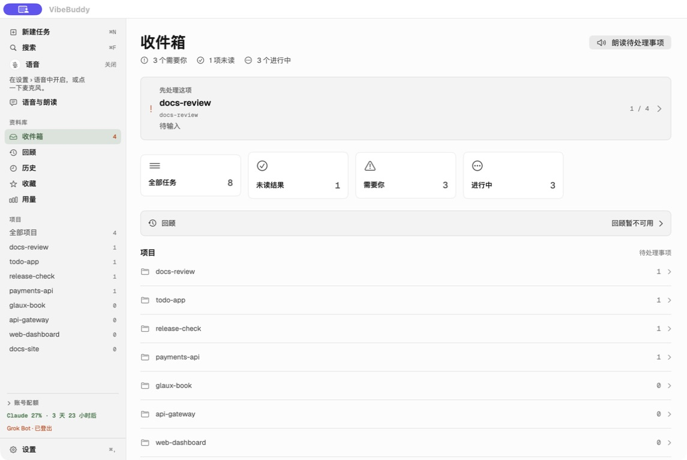
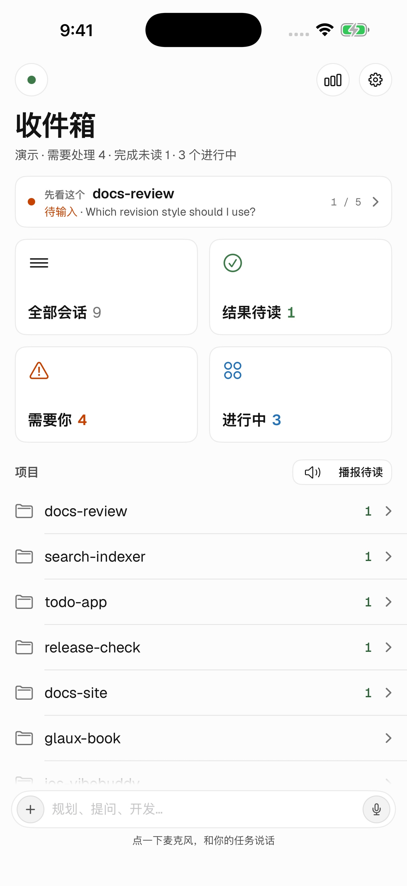
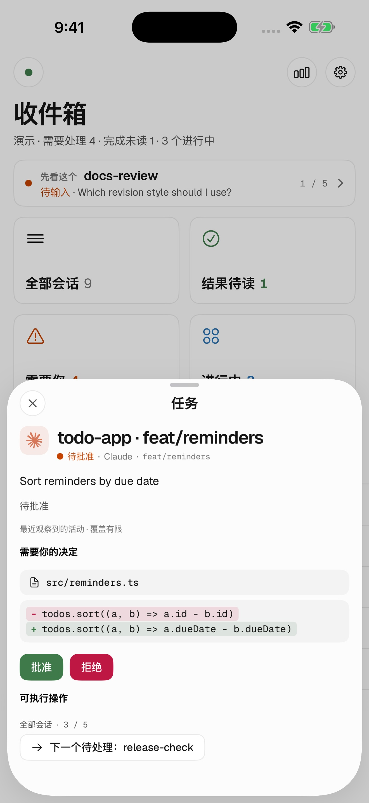
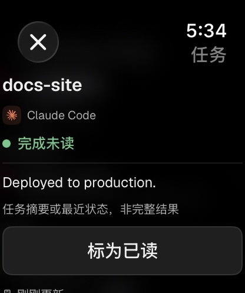
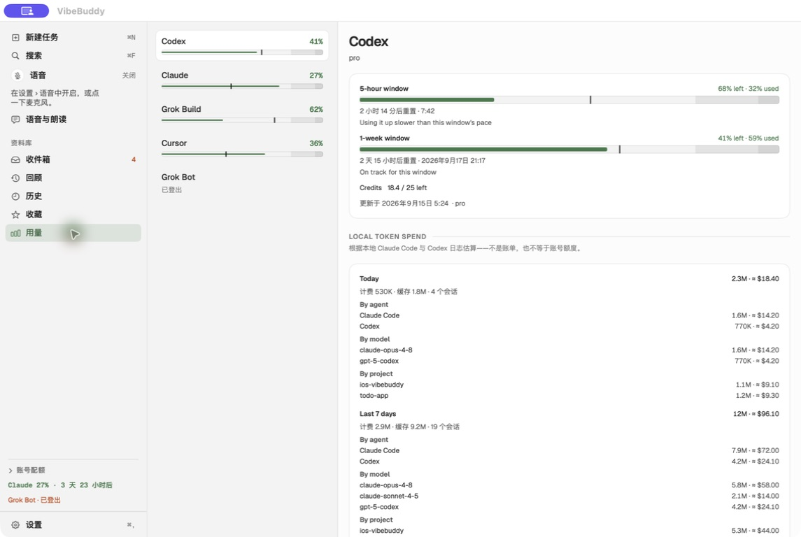
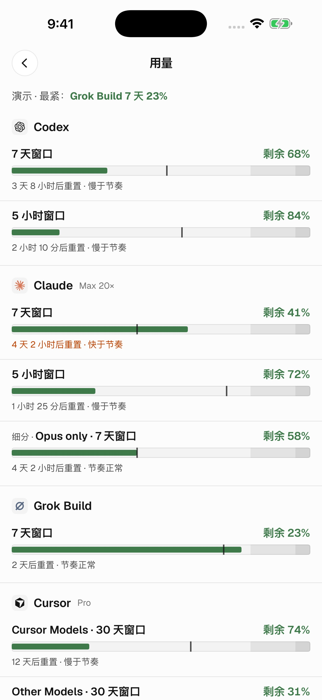
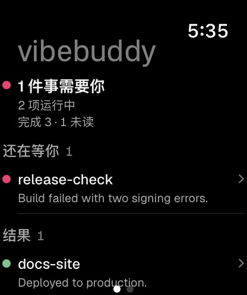
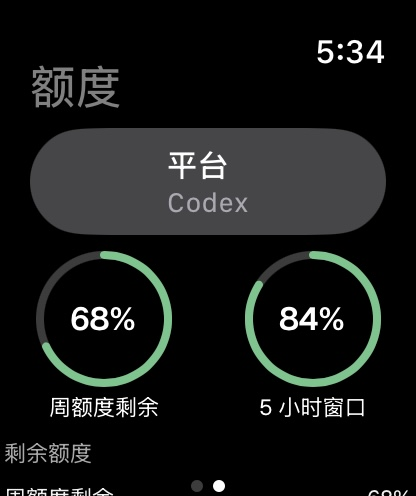
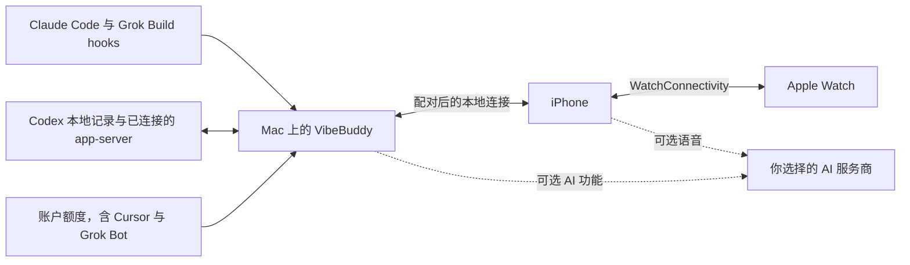

# vibebuddy

### 离开书桌，也能接着推进任务。

陪你使用 AI 工具的 **Mac、iPhone 与 Apple Watch** 原生伴侣。 **Claude Code · Codex · Grok Build · Cursor** 关注任务进展，回应可处理的请求，随时查看账户额度。

[**下载 Mac 版**](https://github.com/semantic-craft/iOS-vibebuddy/releases/latest) · [**获取 iPhone 版**](https://apps.apple.com/us/app/vibebuddy-agent-monitor/id6777469338) · [开始使用](#开始使用) · [关注 X](https://x.com/mm87584) · [English](README.md)

   

**免费开源 · 无需 VibeBuddy 账号 · 无行为分析 · AI 功能使用自己的密钥**

Mac 1.3.19 的真实演示界面。任务、项目和额度均为样例数据。

## 少来回查看，多做自己的事。

让 Claude Code 改代码、Codex 跑测试、Grok Build 执行构建，也能在同一个伴侣中查看 Cursor 与 Grok Bot 的剩余额度。只要 Mac 保持运行、网络可达，你就能在手机上处理问题，在手表上关注任务，或者开口询问最新进展。

| 看清当前情况 | 接着推进任务 | 了解完成结果 |
| --- | --- | --- |
| **统一任务视图。** 需要介入、未读结果、运行中任务；查看项目、模型、当前活动与可获取的用量信息。 | **审批与回复。** 查看命令或有限行数的差异预览，回答问题，继续支持远程控制的 Codex 任务。 | **语音与摘要。** 询问当前任务状态，阅读简明的完成摘要，也可在 Mac 上开启朗读。 |

## 在 Apple 设备间使用 Codex

在 Mac、iPhone 上关注 Codex 任务与用量，在 Apple Watch 上查看完成结果。连接 Codex app-server 后，可以创建、继续、补充指令和停止它所拥有的任务，并处理支持的审批与问题。也支持观测 Codex Desktop 任务；它的原生审批可能仍需回到 Mac 处理。

可选的 OpenAI 语音对话和朗读使用你自己的 API 密钥。仓库公开了 Swift 集成实现、协议检查和已知限制。参见 [Codex 与 OpenAI 工作流](docs/codex-openai-workflows.md)，了解配置方式、源码位置和可自行尝试的流程。

## 三块屏幕，同一个小伙伴。

<table>
<tr><th>iPhone 收件箱</th><th>任务详情</th><th>Watch 完成结果</th></tr>
<tr><td align="center" valign="top"></td><td align="center" valign="top"></td><td align="center" valign="top"></td></tr>
</table>

iPhone／Watch 1.3.17（46），Mac 1.3.19（31）。全部来自原生 App 演示模式，与本次提交的商店截图及 Mac 发布截图一致；不代表真实任务运行结果。 <a href="docs/app-store-screenshots/1.3.17/README.md">截图来源</a>.

更多截图：任务列表与三端额度

<table>
<tr><td align="center" valign="top"></td><td align="center" valign="top"></td><td align="center" valign="top"></td></tr>
</table>

- **Mac：** 从收件箱查看需要介入和未读结果，按项目浏览会话，搜索、阅读历史、查看额度；可通过 Continue with… 交给另一个 Agent 接续。菜单栏与刘海提供紧凑状态。
- **iPhone：** 收件箱、任务详情、近期对话、支持的审批与回复；独立用量页以及主屏幕、锁屏额度小组件。设置中的“电脑连接”和首页连接圆点均可进入扫码配对。
- **Apple Watch：** 查看运行中任务与未读结果，点击完成通知进入对应任务，刷新最新摘要并明确标为已读。仍可查看额度和使用表盘组件；需要配对的 iPhone，通知与后台刷新受系统设置影响。

## 最近的主要更新

| 功能 | 具体变化 |
| --- | --- |
| **收件箱与会话阅读器** | 需要介入、未读结果和运行中任务分别展示；Mac 阅读器支持实时更新、搜索定位和导出。打开详情不等于标为已读。[1.3.17](docs/release-notes-1.3.17.md) |
| **腕上通知直达任务** | 点击完成通知可打开对应详情，并在 iPhone 锁屏时请求最新结果；刷新失败会标示缓存并提供重试。移除了 Watch Recap，保留任务列表和明确的已读操作。[Watch 更新](docs/release-notes-1.3.17.md) |
| **提醒与免打扰** | 修复仅因来源应用处于前台就抑制提醒的问题。关注任务完成时支持有声提醒，继续遵守通知偏好和免打扰设置。[通知更新](docs/release-notes-1.3.17.md) |
| **额度页面与小组件** | iPhone 用量页、主屏幕和锁屏额度小组件展示各服务商读数、更新时间及不可用状态；点击可进入对应服务商。小组件使用最近保存的读数。[用量更新](docs/release-notes-1.3.17.md) |
| **让另一个 Agent 接续** | Mac 的 Continue with… 可选择 Claude Code、Codex 或 Cursor，审阅目录和交接提示后再启动。已观测到的会话目录与交接关系在重启后保留；未知目录由你选择。[交接说明](docs/release-notes-1.3.16.md) |
| **适配当前 Mac 的菜单栏与刘海** | 恢复越界的菜单栏图标位置；紧凑状态显示在摄像头左右，高度读取当前屏幕，宽度随内容调整，无需按机型配置。[菜单栏](docs/release-notes-1.3.18.md) · [刘海](docs/release-notes-1.3.19.md) |
| **语音、摘要与朗读** | 可选语音对话、完成摘要和 Mac 朗读分别配置，支持 OpenAI、Gemini、千问和豆包等已接入服务商。[语音设置](docs/release-notes-1.3.11.md) |

这里展示 Mac 1.3.19 与 iPhone／Watch 1.3.17 的功能。移动端 1.3.17（46）已于 2026-09-15 提交 App Review；提交不代表已获批或已上架。实际可下载版本以 [Mac Releases](https://github.com/semantic-craft/iOS-vibebuddy/releases) 和 [App Store 页面](https://apps.apple.com/us/app/vibebuddy-agent-monitor/id6777469338)为准。

## 常用工具与支持能力

VibeBuddy 连接你已经在用的 Agent。能否操作，取决于当前连接方式和具体请求。

| 连接方式 | 已有集成 | 能力范围 |
| --- | --- | --- |
| **Claude Code** | 生命周期 hooks、任务状态、用量、权限决定与受支持的问题回答。 | 远程回应需要安装审批 hooks；交互由原生提示处理时，回到 Mac 回应。 |
| **Codex CLI／已连接的 app-server** | 任务状态、额度、受支持的审批与问题；通过已连接的 app-server 新建、继续、补充指令和停止任务。 | 连接的服务必须拥有该任务，并能识别相应轮次或请求；MCP elicitation 目前只读。 |
| **Codex Desktop** | 观测本地任务进展和完成结果，跳回应用。 | Desktop 可能使用独立 app-server；原生审批覆盖不完整，没有可回应请求时需使用 Mac 提示。 |
| **Grok Build** | CLI 生命周期 hooks、任务状态、账户额度与配置后的审批通道；从 VibeBuddy 派出的任务经 ACP 托管，支持远程审批、答问、追加指令与停止。 | 终端里自己打开的会话，远程批准能否解除原生提示，取决于 Grok 的权限模式。 |
| **Grok Bot** | 仅账户额度。 | 没有任务集成：任务、回复和审批都在官方 App 中处理。 |
| **Cursor** | Agent 面板与 Cursor CLI 的任务状态、可处理的审批与提问、为进行中的 turn 排队补充一句、用 Cursor CLI 继续已结束的会话，以及账户额度（分别显示 **Cursor Models** 和 **Other Models**）。 | 任务状态与远程回应需要装好 Cursor hooks；没装时仍可由 agent transcript 报告进展。Cursor 没有打断进行中 turn 的接口，也没有直接打开某个会话的链接——跳转只把 Cursor 带到前台。 |

详见 [Codex 集成契约](docs/codex-integration.md)和 [Agent hook 配置](docs/multi-cli-hook-setup.md)。Qwen、Kimi、OpenCode、Antigravity 编码 Agent 适配器属于实验性社区集成；其验证状态与已支持的千问语音服务不同。

## 开始使用

1. **安装 Mac 伴侣。** [下载最新 DMG](https://github.com/semantic-craft/iOS-vibebuddy/releases/latest)，将 App 拖入“应用程序”并打开。发布的 Mac 版需要 Apple Silicon 与 macOS 14+。
2. **接入编码 Agent。** 在 Mac 设置的 Setup 中按对应 Agent 的说明配置，也可查看[手动配置指南](docs/getting-started.md#connect-an-agent)。
3. **连接 iPhone。** 安装 [VibeBuddy: Agent Monitor](https://apps.apple.com/us/app/vibebuddy-agent-monitor/id6777469338)，在 Mac 选择“配对手机”，在 iPhone 的设置 → 电脑连接中选择“扫码配对”，也可点击首页左上角连接圆点。首次在同一可信局域网操作。iPhone 需要 iOS 17+，当前 Watch 伴侣需要 watchOS 26.5+。
4. **试试你的工作流。** 在 Claude Code、Codex 或 Grok Build 发起简短任务并关注至完成，也可接入 [Cursor](docs/getting-started.md#cursor) 或 [Grok Bot](docs/getting-started.md#grok-bot) 额度。语音和摘要可按需单独开启。

**想先看看界面？** iPhone 连接页有“查看演示（无需 Mac）”，Mac 也可独立使用。上述 App Store 链接指向美国商店，是否可下载取决于账号地区；也可[自行编译](docs/getting-started.md#build-from-source)。

### 语音按需开启

选择 **OpenAI、Google Gemini、阿里千问或火山引擎豆包**，在 App 内填写自己的 API 凭据、阅读告知后主动开始通话。可以询问“哪个任务需要我？”，也可以明确回答当前可处理的请求。实时对话、完成摘要和 Mac 朗读分别配置。服务商可能收费；任务看板和按钮审批不需要 AI API 密钥。

### 通知取决于实际配置

手机连接期间会更新实时活动与灵动岛计数。App 关闭后的推送需要 Mac 持续运行、匹配的 APNs 签名配置、已注册的手机及通知权限。**公开下载目前尚未提供开箱即用的闭应用推送配置**，见 [APNs 配置](docs/apns-setup.md)和[分发决策](docs/adr/0013-apns-key-delivery.md)。操作始终需要已配对且网络可达的 Mac；专注模式、通知设置及 watchOS 调度会影响实际呈现。

## 你的 Mac 是连接中心

**没有 VibeBuddy 云端、账号或行为分析服务。** Mac 与手机通过自己的网络通信，使用 bearer token 验证身份。可选 AI 功能把所需音频或任务文本直接发送到你选择的服务商；配置后的推送通知经由 Apple。语音凭据保存在 Keychain。详见[隐私政策](docs/privacy-policy.md)。

## 完整开源，欢迎一起改进

Mac App、iPhone App、Watch 伴侣、守护进程、共享 Swift 模型和 Agent hooks 均在本仓库，以 MIT 许可开放。集成方式及能力范围有对应文档，便于开发者检查、复现和改进。

| 想了解什么 | 从这里开始 |
| --- | --- |
| 编译与运行 | [开发环境配置](docs/getting-started.md#build-from-source) |
| 共享模型与语音适配器 | [VibeBuddyKit](VibeBuddyKit/Sources/VibeBuddyKit) |
| Agent 观测与本地服务 | [VibeBuddyMacCore](VibeBuddyMac/Sources/VibeBuddyMacCore) |
| 原生客户端 | [Mac](VibeBuddyMacApp/Sources) · [iPhone](VibeBuddyApp/Sources) · [Watch](VibeBuddyApp/Watch) |
| 协议检查与设计决策 | [Codex 探针](tools/codex-integration/README.md) · [架构决策](docs/adr) |
| 维护记录 | [发布历史](https://github.com/semantic-craft/iOS-vibebuddy/releases) · [已合并 PR](https://github.com/semantic-craft/iOS-vibebuddy/pulls?q=is%3Apr+is%3Amerged) |

**欢迎贡献。** 复现集成问题、改进翻译、记录设备使用流程，或提交范围明确的修复，都很有帮助。详见 [CONTRIBUTING.md](CONTRIBUTING.md)。如果 VibeBuddy 帮到了你，欢迎点 Star，或分享具体的使用方式，让更多人发现它。

## 作者

由 [Semantic_Craft（@mm87584）](https://x.com/mm87584) 开发。欢迎在 X 上关注我，获取 VibeBuddy 更新，交流 AI 工具的使用心得。

## 致谢

[m5-paper-buddy](https://github.com/op7418/m5-paper-buddy) 启发了通过 hook 与对话记录观测任务状态的思路；[open-vibe-island](https://github.com/Octane0411/open-vibe-island) 为多 Agent 模型与 Mac Glance 提供了参考。VibeBuddy 的 Swift 实现为独立编写。App 图标借助 [ip-as-logo skill](https://github.com/s1dashu/ip-as-logo-skill)设计，App 内的小猫由共享 Swift 代码绘制。

[MIT](LICENSE)。独立社区项目，与 Anthropic、OpenAI 或 Apple 无隶属或背书关系。

离开局域网时，可通过外置 Tailscale 连接：[远程连接设置](docs/getting-started.md#remote-access-with-tailscale)。
