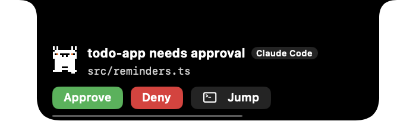
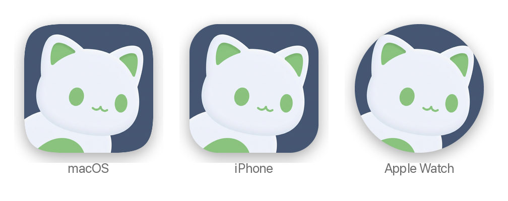

<div align="center">


# vibebuddy

**Claude Code 与 Codex 的 iPhone、Apple Watch 和 Mac 伴侣。**
离开电脑，也能看进度、查看需要回应的任务，并处理支持的批准与提问。让小猫帮你盯着任务，把注意力留给生活。

[**⬇️ 下载 macOS 版**](https://github.com/semantic-craft/iOS-vibebuddy/releases/latest) · [功能](#-功能) · [工作原理](#-工作原理) · [从源码构建](#️-构建与运行) · [English](./README.md)


[](https://github.com/semantic-craft/iOS-vibebuddy/releases/latest)

</div>

---

## 从初版看状态，到三端协作

**1.3 候选版，是一次从手机看板到桌面、口袋与手腕的重大升级。** 初版以会话状态和本地提醒为核心；新版把 Codex 深度集成、手表小组件与统一交互带到日常使用中。

| 升级 | 对你有什么用 |
|---|---|
| **Agent 适配持续升级** | 围绕 Claude Code 与 Codex 的任务、权限请求和提问完善接入；支持情况见下方适配说明。 |
| **Codex 深度集成** | 覆盖 Desktop 与 CLI 的状态观测，并在支持的连接中处理提问、追加指令和发起任务。 |
| **新增 Apple Watch 表盘小组件** | 矩形“关注任务”看任务状态；圆形“额度”查看 Claude、Codex 或两者的剩余额度，提供五种显示样式。 |
| **图标与交互全面焕新** | 三端统一小猫形象与 Agent 图标；手机配对连接菜单更简洁，任务状态更易辨认。 |
| **macOS UI 更新** | 菜单栏、刘海概览与任务卡片协同呈现，改善仪表盘重新打开及概览位置恢复。 |

> 此处介绍当前源码与 1.3 候选功能，尚不代表公开发布或完成真机验收。GitHub 最新公开 Mac 包目前为 1.1；新版发布后，请同步更新 Mac 伴侣。表盘刷新由系统调度，额度取决于来源提供的数据。

## 第一次使用，从这里开始

1. **在 Mac 下载并安装 [Mac 版伴侣](https://github.com/semantic-craft/iOS-vibebuddy/releases/latest)**：打开 Release 的 Assets，下载 DMG，将应用拖入“应用程序”。需要 Apple Silicon Mac、macOS 14 或更高版本。
2. **在 Mac 菜单栏打开“配对手机”**，让 iPhone 与 Mac 连接同一局域网。
3. **在 iPhone 点“扫码配对”**，扫描 Mac 显示的二维码。随后按 Mac 设置中的 Setup 指引接入 Agent。
4. **先体验也可以**：iPhone 连接页点“查看演示（无需 Mac）”，浏览示例任务；真实任务需要已配对且可连接的 Mac。

真实任务数据主要来自你自己的 Mac；请保持 Mac 伴侣运行、网络可连接。Apple Watch 功能还需要配对的 iPhone。iPhone 当前获取方式见下方“下载”；App Store 新版文案正在准备中。

---

## 🐱 30 秒介绍

你同时开了三个 Claude Code 会话，又切到 Codex 跑第四个，转身去倒了杯咖啡——回来已经分不清：哪个 agent 卡着在等你确认，哪个还在埋头干活，哪个早就跑完在那儿空等。

**vibebuddy** = Mac 菜单栏里的一只小猫 + iPhone 上的伴侣 App。它盯着每一个编程 agent 会话，只回答最关键的三个问题：

> ### 🟠 需要回应 · 🔵 进行中 · 🟢 已完成

再也不用走回电脑前，才发现某个会话已经卡在权限确认上十分钟了。手机一震，你查看 diff 预览，点一下**批准**——或者点一下那只猫，**直接说一句"批准"**。

<div align="center">


<sub><b>Mac 菜单栏应用</b>——所有会话分三栏、语音宠物，以及远程批准详情面板。</sub>

<br><br>




<sub><b>刘海概览</b>——像灵动岛一样贴着刘海：空闲时什么都不显示，有事时小猫 + 最要紧的计数分列两侧，悬停展开，审批直接以卡片从刘海下方掉出来就地处理。</sub>

<br><br>


<sub><b>在你的 iPhone 上</b>——点开一个会话，看内联 diff 并 批准 / 拒绝。</sub>

</div>

<div align="center">



<sub><b>一个图标，三个平台</b>——同一只小猫出现在 Mac、iPhone 和 Apple Watch 上，由各系统套上自己的遮罩。</sub>

</div>

> **应用图标**是一只绿耳朵、绿眼睛的小白猫，趴在柔和的石板蓝底上——一个柔软的剪影、三种颜色，缩到 16 px 仍能认出来。它用 [ip-as-logo](https://github.com/s1dashu/ip-as-logo-skill) 技能设计，从六张生成候选中选出；同一张 1024 px 原图同时用于 macOS、iOS 和 watchOS。
>
> App 里的 **buddy 就是同一只猫，纯代码绘制**，iPhone、Apple Watch、灵动岛、Mac 仪表盘、刘海概览和菜单栏共用一套几何。心情（耳朵、眼睛、嘴巴）和小动作随会话变化；在紧凑位置（菜单栏、收起的刘海概览、灵动岛、手表标题栏）只画头部，菜单栏里是单色模板剪影，只有 iPhone 和 Mac 上会动。以上截图均为**演示模式**（示例数据），不含任何真实会话数据。

---

## ✨ 功能

### 🎙️ 和你的 agent 对话——语音伴侣
语音伙伴默认关闭。选择服务商、填写自己的 API key、接受数据用途说明并授予麦克风权限后，可主动开始语音交流，询问任务状态或处理支持的请求。音频与所选任务上下文直接发送至所选服务商（OpenAI、Google Gemini 或阿里云百炼 / 通义千问），可能产生服务商费用。可执行操作取决于连接与请求支持情况；不启用语音也能使用任务看板和按钮批准。

### 📊 三栏仪表盘
每个会话按 **需要回应 / 进行中 / 已完成** 分组，每行显示 项目 · 分支 · 模型 · 实时 token 与上下文窗口占用 · 当前正在执行的工具 · 最近输出的预览。优先级很诚实：`需要回应` 永远盖过 `进行中`。

### ✅ 远程批准
当 agent 请求执行命令或修改文件时，可在手机仪表盘查看命令或 **diff 预览**。diff 每侧最多显示八行；需要更多上下文时，请到 Mac 查看完整改动。可在仪表盘或锁屏通知中**批准 / 拒绝**（批准需要解锁），可远程作答的问题通知提供文本输入。**总是允许这一条** / **本次会话全部允许**仅在仪表盘提供，不是通知按钮。只读等待会提示到 Mac 原生对话框处理。操作要求已配对且 Mac 可达。

### 🔔 通知、实时活动与灵动岛
审批和问题横幅在最终投递级别带声音时请求 **Time Sensitive（时效性通知）**；Quiet 会将它们降为普通静音横幅，其余类别使用普通级别。类别开关及系统通知／专注模式设置仍然生效。ActivityKit 将实时计数显示在**锁屏和灵动岛**上，并在 App 位于前台或保持连接时更新。

当前源码支持关闭 iPhone App 后通过 APNs 接收通知，条件是 Mac 发送端正在运行、APNs 签名与 iPhone 构建匹配、手机已注册且允许通知。这尚不是公开下载后开箱即用的承诺：分发方案仍待 [DEC-APNS](docs/adr/0013-apns-key-delivery.md)，锁屏／专注模式／Watch 送达仍需真机验收。回应要求已配对的 Mac 可达；离开该网络时应回到同一网络后处理（已有 Tailscale 连接可作为进阶方案）。

### 🤖 三家现有适配，Cursor 计划中，以及社区适配器
一等支持路线图覆盖 **Claude Code、Codex、Grok、Cursor**：三态追踪与远程审批是必需能力，配额和跳转尽力支持。Claude Code、Codex、Grok 已有适配器；**Cursor 仍在计划中，尚未支持**。每家仍需分别完成真机验收。**Qwen、Kimi、OpenCode、Antigravity** 为社区级适配器，未验证、失败即放行。各家的接线方法见 [hook 配置指南](docs/multi-cli-hook-setup.md)。

### 📷 扫码配对，零输入
Mac 显示一个编码了 `host:port` + bearer token 的二维码。手机扫一次即可——无需手动输 IP。（同一个二维码以后可以承载 Tailscale `100.x` 地址，无需改代码。）

### 🖥️ 原生 Mac 菜单栏应用
`MenuBarExtra` 实时计数概览、macOS 刘海概览、**跳转到终端**（一键打开对应会话）、开机自启，以及持久化在仅所有者可读写（`0600`）文件 `~/Library/Application Support/vibebuddy/token` 中的局域网 bearer token。还有 ⏎ / ⌘F 仪表盘快捷键。v1.1 使用带签名的 Sparkle 更新源；原 v1.0 用户需要先手动安装一次新版。

### 🔒 本地优先，隐私至上
vibebuddy 在你的 Mac 与手机之间**直接**通过你自己的网络通信。会话数据**绝不**经过 vibebuddy 服务器——没有 vibebuddy 云、没有账号、没有埋点、没有追踪。守护进程路由由 bearer token 把关。配置 APNs 后，通知负载（包括标题和正文）会经过 Apple 推送服务。（可选语音伙伴只会在你开启后，把麦克风音频和所选会话上下文发往*你选择*的服务商，并使用*你自己*的 key。）

### 🌏 双语 + 演示模式
两端 App 都支持完整的中英文界面。还有一个**演示模式**，用示例数据加载整个界面——无需 Mac 即可浏览示例任务。

---

## ⬇️ 下载

### macOS 应用
**[下载最新版 Mac Companion →](https://github.com/semantic-craft/iOS-vibebuddy/releases/latest)** · Apple Silicon · macOS 14+

v1.1 DMG 已使用 Developer ID 签名并完成公证。打开后把 **VibeBuddyMacApp** 拖入**应用程序**，无需执行移除隔离属性的命令。

**从 v1.0 更新：**请手动安装一次 v1.1。原 v1.0 内置更新地址无效，不能自动发现本次更新；v1.1 使用正式 Sparkle 更新源接收后续版本。源码构建和 GitHub 发布包是不同交付物，需要直接安装时请使用上方最新版 Release 资产。

### iPhone 应用
目前请从源码构建——见 [构建与运行](#️-构建与运行)。装到你自己的 iPhone 上即可；没有公开的 iPhone 下载。

---

## 🧠 工作原理

```
Claude Code / Codex / Qwen / … ──hooks──▶ vibebuddy（macOS 菜单栏应用）
                                          • 把 hooks 归约为 needsResponse / working / done
                                          • 解析 JSONL transcript → 模型 / tokens / 摘要
                                          • 在局域网上提供服务（HTTP /snapshot、WebSocket /ws）
                                                  │  扫码配对（host:port + token）
                                                  ▼
                                          vibebuddy（iPhone，SwiftUI）
                                          • 三栏仪表盘 + 实时活动
                                          • 通知 + 远程批准 + 语音伴侣
                  共享 VibeBuddyKit —— 唯一一套 Codable 线缆模型，只写一次
```

最难的部分——*检测*会话状态——由每个 agent CLI 在其生命周期事件（`UserPromptSubmit`、`PreToolUse`、`Notification`、`Stop` …）上触发的 **hooks** 解决。vibebuddy 把它们归约为三种状态，再广播一份受 token 保护的快照。这些 hook **失败即放行**：vibebuddy 没运行时，你的 agent 完全不受影响。

---

## 🛠️ 构建与运行

部署目标：**iOS 17 / macOS 14**。1.2 候选使用 **Xcode 26.6** 构建；Xcode 27 工作暂缓，留待后续更新。

| 路径 | 内容 |
|------|------|
| `VibeBuddyKit/` | 共享 Codable 线缆模型（SwiftPM） |
| `VibeBuddyMac/` | macOS 核心库 + `vibebuddyd` 无头 CLI（SwiftPM） |
| `VibeBuddyMacApp/` | macOS 菜单栏应用（xcodegen）—— 仅所有者可读写的局域网 token 文件、开机自启、Sparkle |
| `VibeBuddyApp/` | iOS 应用（xcodegen） |
| `docs/planning/` | 概览、PRD、架构、路线图、先行研究 |

**Mac 端（菜单栏应用）：**
```bash
cd VibeBuddyMacApp && xcodegen generate
open VibeBuddyMacApp.xcodeproj   # 构建并运行（⌘R）
```
一个纯菜单栏应用：实时计数、"配对手机"二维码、开机自启；Mac 守护进程的 `TokenStore` 把局域网 token 保存在仅所有者可读写的文件 `~/Library/Application Support/vibebuddy/token` 中。（`VibeBuddyMac/` 里的 `vibebuddyd` 是无头等价物：`swift run vibebuddyd`。）

**iOS 应用：**
```bash
cd VibeBuddyApp && xcodegen generate
open VibeBuddyApp.xcodeproj   # 在模拟器/真机上运行
```
扫码配对，或手动输入 host/port/token。在 iOS 上，`ConnectionStore` 把配对 payload 持久化到 `UserDefaults`。（模拟器：用 `127.0.0.1` 和 `~/Library/Application Support/vibebuddy/token` 里的 token。）

**Hooks（接入真实 agent 会话）：**
```bash
python3 hooks/install-claude-hooks.py --dry-run    # 预览改动
python3 hooks/install-claude-hooks.py --install    # 备份并安装
python3 hooks/install-claude-hooks.py --uninstall  # 还原
```
为每个生命周期事件安装失败即放行的 `curl` POST。所有受支持的 CLI 见 [`docs/multi-cli-hook-setup.md`](docs/multi-cli-hook-setup.md)。

**测试：**
```bash
cd VibeBuddyKit && swift test     # 线缆模型测试
cd VibeBuddyMac && swift test     # 守护进程 / 归约器 / transcript 测试
```

---

## 💡 灵感来源

vibebuddy 站在两个聪明项目的肩膀上——它们最早证明了可以从 hooks 和 transcript 尾部*检测*编程 agent 的状态，我们把这个想法重新指向了手机（并加上了双向语音）。我们**研究了它们的架构、自己写了 Swift**；没有复制任何代码。

- **[op7418/m5-paper-buddy](https://github.com/op7418/m5-paper-buddy)** —— 通过解析 transcript 尾部的 JSONL 和失败即放行的 hook `curl`，把 agent 的 RUNNING / WAITING 状态显示在 **M5Paper 墨水屏小工具**上。vibebuddy 借用了它的检测理念，把显示从桌面小工具搬进了你的口袋。
- **[Octane0411/open-vibe-island](https://github.com/Octane0411/open-vibe-island)** —— 一个跨 10+ agent 的、与来源无关的 `SessionState` 归约器，呈现在 **macOS 菜单栏 / 刘海**上。它塑造了 vibebuddy 的多 agent 模型和 Mac 端概览。

---

## 📍 状态

Mac v1.1 源码已包含 Codex Desktop 0.153.3 观测、UTF-8 截断处理、守护进程正常退出、观测诊断和 Watch 伴侣支持。Mac、iPhone、Apple Watch 已在本地安装，真实手机审批、恢复及手机到手表的状态传递已验证。完整腕上审批、通知感知、语音与可访问性体验仍留待实际使用确认。App Store 上架与 Mac GitHub 发布分别推进。见[最新 Mac Release](https://github.com/semantic-craft/iOS-vibebuddy/releases/latest)和[路线图](docs/planning/roadmap.md)。

## 📄 许可

[MIT](./LICENSE) © 2026 Xianwei Zhang
