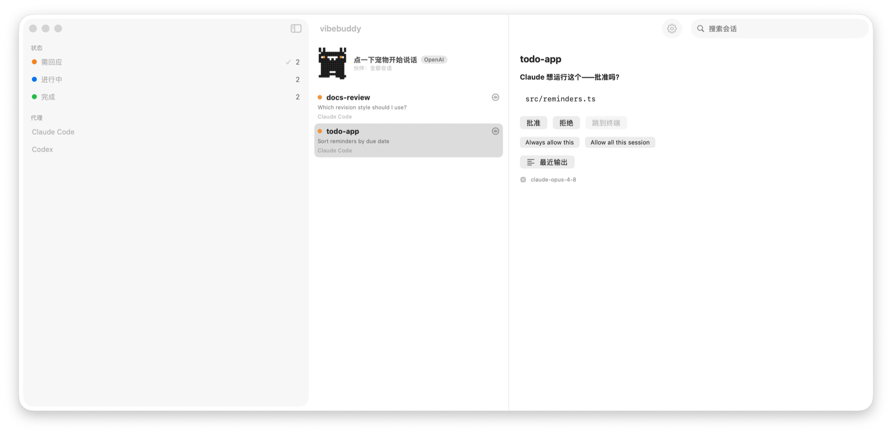
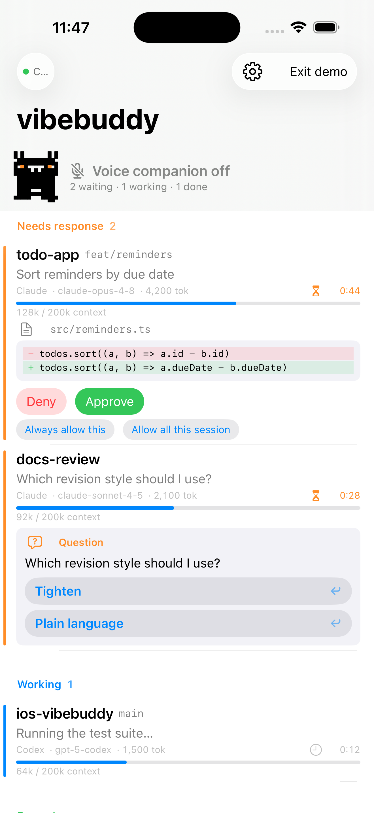

<div align="center">


# vibebuddy

**你的 AI 编程助手，装进手机里。**
一眼看清每个会话状态，谁需要你立刻就推送提醒，在锁屏上看到完整命令并批准——甚至可以**直接用语音和你的 agent 对话**。

[**⬇️ 下载 macOS 版**](https://github.com/semantic-craft/iOS-vibebuddy/releases/latest) · [功能](#-功能) · [工作原理](#-工作原理) · [从源码构建](#️-构建与运行) · [English](./README.md)


[](https://github.com/semantic-craft/iOS-vibebuddy/releases/latest)

</div>

---

## 🐱 30 秒介绍

你同时开了三个 Claude Code 会话，又切到 Codex 跑第四个，转身去倒了杯咖啡——回来已经分不清：哪个 agent 卡着在等你确认，哪个还在埋头干活，哪个早就跑完在那儿空等。

**vibebuddy** = Mac 菜单栏里的一只小猫 + iPhone 上的伴侣 App。它盯着每一个编程 agent 会话，只回答最关键的三个问题：

> ### 🟠 需要回应 · 🔵 进行中 · 🟢 已完成

再也不用走回电脑前，才发现某个会话已经卡在权限确认上十分钟了。手机一震，你看到完整 diff，点一下**批准**——或者点一下那只猫，**直接说一句"批准"**。

<div align="center">



<sub><b>Mac 菜单栏应用</b>——所有会话分三栏、语音宠物，以及远程批准详情面板。</sub>

<br><br>


<sub><b>常驻刘海概览</b>——同一只猫 + 实时 🟠 / 🔵 / 🟢 计数。</sub>

<br><br>



<sub><b>在你的 iPhone 上</b>——点开一个会话，看内联 diff 并 批准 / 拒绝。</sub>

</div>

> 这只 buddy 是**同一只猫、纯代码绘制，在 iPhone、Mac 仪表盘和刘海概览上完全一致**——只有心情（眼睛和耳朵）和颜色（深色刘海上变白）会变。以上截图均为**演示模式**（示例数据），不含任何真实会话数据。

---

## ✨ 功能

### 🎙️ 和你的 agent 对话——语音伴侣
别家没有的杀手锏。点一下小猫，就能和正在运行的 agent 进行**实时语音对话**。问一句"payments 那个会话在等什么？"，然后**用语音批准、拒绝或回答提问**——它通过结构化 function calling 真正执行操作，而不是截屏识别。使用**你自己的 AI key**（OpenAI、Google Gemini，或阿里云百炼 / 通义千问），**不加 key 就完全关闭**，语音**在设备端本地识别**，说一口流利中文（Aoede 音色），并且被硬性限制**拒绝泄露 agent 的系统提示词**。

### 📊 三栏仪表盘
每个会话按 **需要回应 / 进行中 / 已完成** 分组，每行显示 项目 · 分支 · 模型 · 实时 token 与上下文窗口占用 · 当前正在执行的工具 · 最近输出的预览。优先级很诚实：`需要回应` 永远盖过 `进行中`。

### ✅ 远程批准
当 agent 请求执行命令或修改文件时，**完整命令或 diff** 直接推到你手机上。**批准 / 拒绝**，或者 **总是允许这一条** / **本次会话全部允许**——在仪表盘或锁屏上一键搞定。

### 🔔 通知、实时活动与灵动岛
会话需要你的那一刻就弹横幅。实时计数通过 ActivityKit 显示在**锁屏和灵动岛**上，并用 **APNs 推送**保持更新——即使 App 已关闭。

### 🤖 适配你的整个 agent 矩阵
从第一天起就与来源无关。**Claude Code 与 Codex** 已端到端测试；**Qwen、Kimi、Grok、OpenCode、Gemini（Antigravity）** 适配器随附。一个通用 hook 安装器全部搞定。

### 📷 扫码配对，零输入
Mac 显示一个编码了 `host:port` + bearer token 的二维码。手机扫一次即可——无需手动输 IP。（同一个二维码以后可以承载 Tailscale `100.x` 地址，无需改代码。）

### 🖥️ 原生 Mac 菜单栏应用
`MenuBarExtra` 实时计数概览、macOS 刘海概览、**跳转到终端**（一键打开对应会话）、开机自启、Keychain 存储的 token，以及 Sparkle 自动更新。还有 ⏎ / ⌘F 仪表盘快捷键。

### 🔒 本地优先，隐私至上
vibebuddy 在你的 Mac 与手机之间**直接**通过你自己的网络通信。会话数据**绝不**经过任何服务器——没有 vibebuddy 云、没有账号、没有埋点、没有追踪。守护进程路由由 bearer token 把关。（唯一会离开设备的是语音，且仅在你开启时、发往*你选择*的服务商、用*你自己*的 key。）

### 🌏 双语 + 演示模式
两端 App 都支持完整的中英文界面。还有一个**演示模式**，用示例数据加载整个界面——无需 Mac 即可体验全部功能。

---

## ⬇️ 下载

### macOS 应用
**[下载 vibebuddy-mac-v1.0.dmg →](https://github.com/semantic-craft/iOS-vibebuddy/releases/latest)** · Apple Silicon · macOS 14+

> **首次打开（未签名版）。** 这个早期版本尚未公证，首次打开会被 macOS Gatekeeper 拦截。打开 `.dmg`，把 **vibebuddy** 拖进**应用程序**，然后**右键 → 打开 → 打开**，或在终端执行一次：
> ```bash
> xattr -dr com.apple.quarantine /Applications/vibebuddy.app
> ```
> 正式签名 + 公证版（双击即开、零警告）即将推出。

### iPhone 应用
目前请从源码构建——见 [构建与运行](#️-构建与运行)。（App Store 上架审核中。）

---

## 🧠 工作原理

```
Claude Code / Codex / Qwen / … ──hooks──▶ vibebuddy（macOS 菜单栏应用）
                                          • 把 hooks 归约为 needsResponse / working / done
                                          • 解析 JSONL transcript → 模型 / tokens / 摘要
                                          • 在局域网上提供服务（HTTP /snapshot、WebSocket /ws）
                                                  │  扫码配对（host:port + token）
                                                  ▼
                                          vibebuddy（iPhone，SwiftUI）
                                          • 三栏仪表盘 + 实时活动
                                          • 通知 + 远程批准 + 语音伴侣
                  共享 VibeBuddyKit —— 唯一一套 Codable 线缆模型，只写一次
```

最难的部分——*检测*会话状态——由每个 agent CLI 在其生命周期事件（`UserPromptSubmit`、`PreToolUse`、`Notification`、`Stop` …）上触发的 **hooks** 解决。vibebuddy 把它们归约为三种状态，再广播一份受 token 保护的快照。这些 hook **失败即放行**：vibebuddy 没运行时，你的 agent 完全不受影响。

---

## 🛠️ 构建与运行

| 路径 | 内容 |
|------|------|
| `VibeBuddyKit/` | 共享 Codable 线缆模型（SwiftPM） |
| `VibeBuddyMac/` | macOS 核心库 + `vibebuddyd` 无头 CLI（SwiftPM） |
| `VibeBuddyMacApp/` | macOS 菜单栏应用（xcodegen）—— Keychain token、开机自启、Sparkle |
| `VibeBuddyApp/` | iOS 应用（xcodegen） |
| `docs/planning/` | 概览、PRD、架构、路线图、先行研究 |

**Mac 端（菜单栏应用）：**
```bash
cd VibeBuddyMacApp && xcodegen generate
open VibeBuddyMacApp.xcodeproj   # 构建并运行（⌘R）
```
一个纯菜单栏应用：实时计数、"配对手机"二维码、开机自启；局域网 token 存在 Keychain 里。（`VibeBuddyMac/` 里的 `vibebuddyd` 是无头等价物：`swift run vibebuddyd`。）

**iOS 应用：**
```bash
cd VibeBuddyApp && xcodegen generate
open VibeBuddyApp.xcodeproj   # 在模拟器/真机上运行
```
扫码配对，或手动输入 host/port/token。（模拟器：用 `127.0.0.1` 和 `~/Library/Application Support/vibebuddy/token` 里的 token。）

**Hooks（接入真实 agent 会话）：**
```bash
python3 hooks/install-claude-hooks.py --dry-run    # 预览改动
python3 hooks/install-claude-hooks.py --install    # 备份并安装
python3 hooks/install-claude-hooks.py --uninstall  # 还原
```
为每个生命周期事件安装失败即放行的 `curl` POST。所有受支持的 CLI 见 [`docs/multi-cli-hook-setup.md`](docs/multi-cli-hook-setup.md)。

**测试：**
```bash
cd VibeBuddyKit && swift test     # 线缆模型测试
cd VibeBuddyMac && swift test     # 守护进程 / 归约器 / transcript 测试
```

---

## 💡 灵感来源

vibebuddy 站在两个聪明项目的肩膀上——它们最早证明了可以从 hooks 和 transcript 尾部*检测*编程 agent 的状态，我们把这个想法重新指向了手机（并加上了双向语音）。我们**研究了它们的架构、自己写了 Swift**；没有复制任何代码。

- **[op7418/m5-paper-buddy](https://github.com/op7418/m5-paper-buddy)** —— 通过解析 transcript 尾部的 JSONL 和失败即放行的 hook `curl`，把 agent 的 RUNNING / WAITING 状态显示在 **M5Paper 墨水屏小工具**上。vibebuddy 借用了它的检测理念，把显示从桌面小工具搬进了你的口袋。
- **[Octane0411/open-vibe-island](https://github.com/Octane0411/open-vibe-island)** —— 一个跨 10+ agent 的、与来源无关的 `SessionState` 归约器，呈现在 **macOS 菜单栏 / 刘海**上。它塑造了 vibebuddy 的多 agent 模型和 Mac 端概览。

---

## 📍 状态

v1 核心已完成并端到端验证：三栏仪表盘、扫码配对、通知、远程批准、实时活动 / 灵动岛、语音伴侣，以及多 CLI hooks（Claude Code + Codex 已测试）。见 [`docs/planning/roadmap.md`](docs/planning/roadmap.md)。

## 📄 许可

[MIT](./LICENSE) © 2026 Xianwei Zhang
