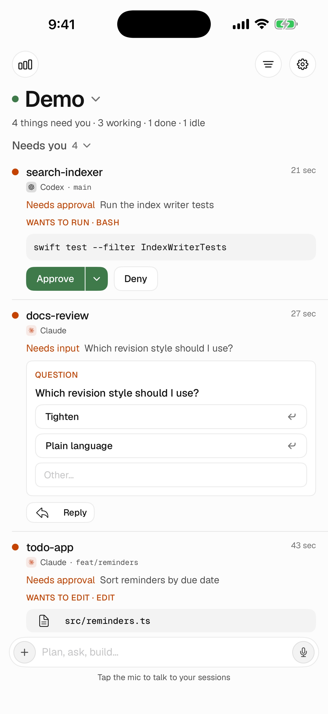
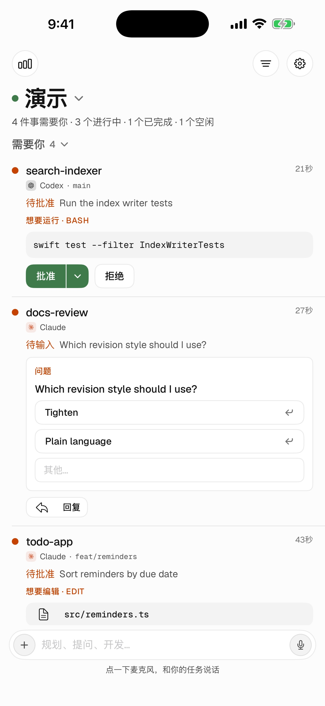
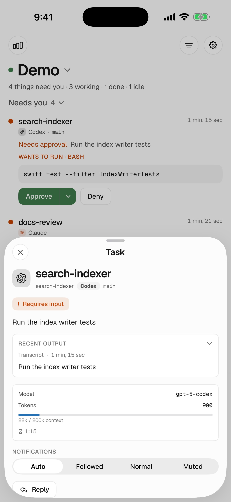
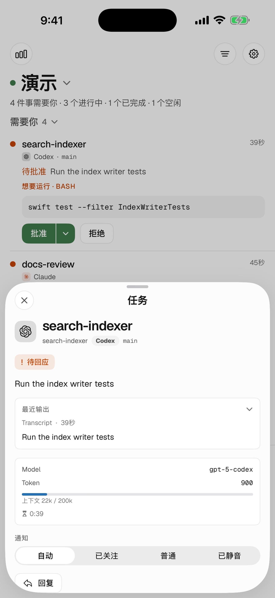
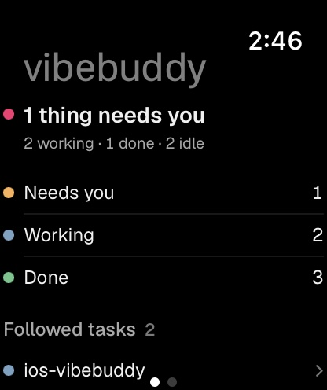
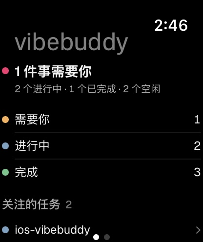
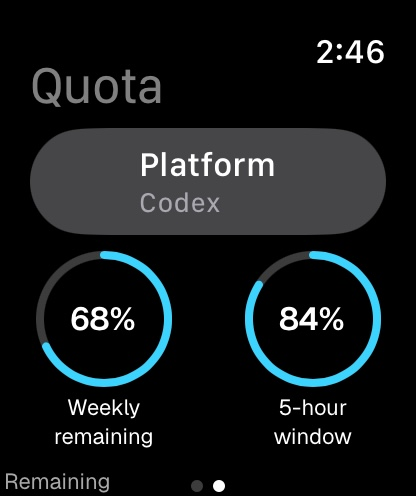
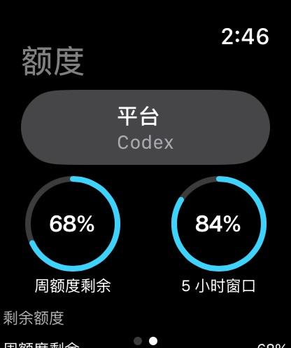
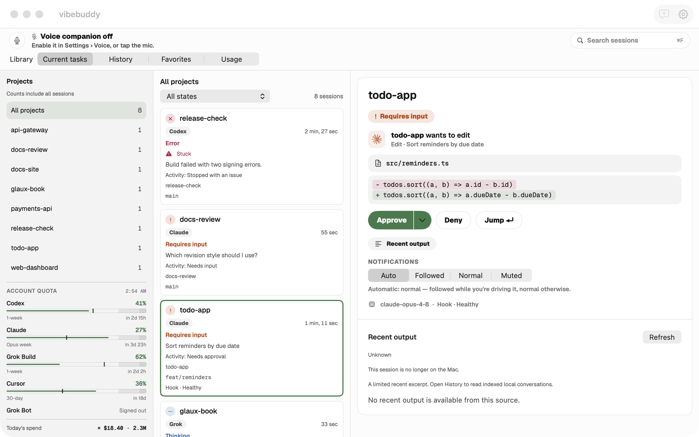
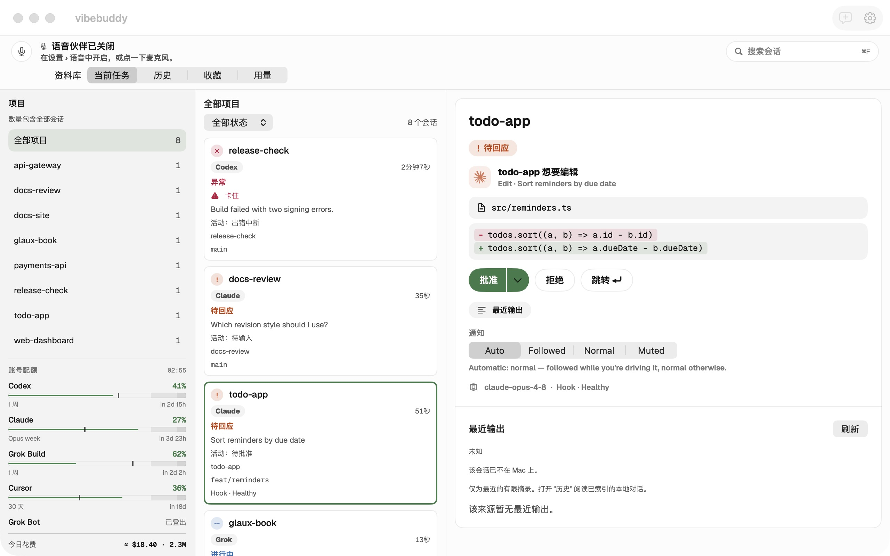

# VibeBuddy 1.3.14 截图包

2026-09-13 实拍，对应 Cursor 视觉语言整合分支（`feat/cursor-visual-language`，PR #161）。本目录共 **12 张**：iOS 4 张、watchOS 4 张、审核配对参考 2 张，以及 Mac 2 张。移动端 10 张全部来自实际运行的 App 演示界面，没有生成、重绘、裁切、叠字或缩放；图片均为 RGB JPEG、无透明通道。文件名数字是各语言内的建议上传顺序。**Mac 两张由 Mac 端单独采集并提交**（提交 `136239f7`），其来源信息以该轮记录为准，本文只登记文件哈希。

## 上传位置

| 文件夹 | 每种语言 | 尺寸 | 用途 |
|---|---:|---|---|
| `ios/en-US`、`ios/zh-Hans` | 2 张 | 1320 × 2868 | iPhone 6.9-inch 栏：任务列表（三组，含一条审批和一条提问）、Codex 任务表 |
| `watchos/en-US`、`watchos/zh-Hans` | 2 张 | 416 × 496 | Apple Watch 栏：任务概览、额度；两种语言尺寸一致 |
| `macos/en-US`、`macos/zh-Hans` | 1 张 | 2560 × 1600 | Mac 平台截图尺寸；由 Mac 端采集，不要上传到 iPhone 截图栏 |
| `reviewer/en-US`、`reviewer/zh-Hans` | 1 张 | 1320 × 2868 | 首次配对及演示入口参考，不作为主宣传截图 |

应用当前 `TARGETED_DEVICE_FAMILY=1`，本包不包含 iPad。尺寸依据 [Apple Screenshot specifications](https://developer.apple.com/help/app-store-connect/reference/app-information/screenshot-specifications/)：iPhone 使用受支持的 6.9-inch 尺寸（iPhone 17 Pro Max 模拟器原生分辨率），Watch 使用 Apple Watch Series 11 (46mm) 原生分辨率，与 1.3 包相同。

## 当前素材边界

- **演示数据只用于说明界面。** 任务状态、审批命令、提问选项、额度百分比和模型名称都是 `VIBEBUDDY_DEMO=1` 内置的固定样例，不构成真实 Agent 兼容性、通知送达、真实审批或额度验证。样例项目名、分支、命令和模型名保留英文。
- **中文环境仍有未翻译文案**：任务表内 “Model”“Token”“Transcript”，配对参考页第 2 步正文 “Open “Pair a phone” in the Mac menu bar…”，以及工具类型 “BASH”“EDIT”。图片没有替换这些文字；若发布前完善本地化，应从最终成品重拍受影响页面。
- 任务表把当前状态显示为 “Requires input / 待回应”，而列表行显示 “Needs approval / 待批准”，两处用词不一致；这是界面现状，未做修饰。
- Watch 拍的是 **App 内任务与额度页面**，不是表盘小组件。额度页可滚动，本图只含平台与两个环形进度；下方内容仍在滚动页中。
- 图片来自 Release 模拟器构建，不是 Distribution archive 或真机验收；版本号仍是源码树中的 1.3.13(27)，1.3.14 的版本号递增和送审构建另行产生。发布 build 若改变界面或本地化，应重拍受影响页面。
- 全部 12 张状态为 **未上传**。

## 来源与重拍信息

- 移动端 10 张（iOS 4、watchOS 4、配对参考 2）来源 HEAD `29dabd5fd101ae855da0f9365ec37b6f1a93b744`（`fix(watch): count the wrist's buckets by attention, like every other surface`）。之后仅有 Mac 截图的文档提交，App 源码未变。
- 构建：Release 模拟器构建，运行时 iOS 26.5 / watchOS 26.5，`CODE_SIGNING_ALLOWED=NO`。项目 `project.yml` 已把 watchOS 部署目标设为 26.5，本轮不需要 1.3 包用过的 `WATCHOS_DEPLOYMENT_TARGET=26.5` 覆盖。命令（工作目录 `VibeBuddyApp`）：

  ```
  xcodegen generate --spec project.yml
  xcodebuild build -project VibeBuddyApp.xcodeproj -scheme VibeBuddyApp -configuration Release \
    -destination 'generic/platform=iOS Simulator' -derivedDataPath <scratch>/dd-release CODE_SIGNING_ALLOWED=NO
  ```

  产物 `Release-iphonesimulator/VibeBuddyApp.app` 与 `Release-watchsimulator/VibeBuddyWatch.app`，用 `xcrun simctl install` 装入专用模拟器。
- 模拟器：专用设备，拍完即删。iPhone `xcrun simctl create "VibeBuddy Shots 17PM" "iPhone 17 Pro Max" com.apple.CoreSimulator.SimRuntime.iOS-26-5`；Watch `xcrun simctl create "VibeBuddy Shots Watch" "Apple Watch Series 11 (46mm)" com.apple.CoreSimulator.SimRuntime.watchOS-26-5`。iPhone 状态栏 `xcrun simctl status_bar <udid> override --time 9:41 --batteryState charged --batteryLevel 100 --wifiBars 3 --cellularBars 4`；外观 `xcrun simctl ui <udid> appearance light`。Watch 模拟器不支持状态栏覆盖，保留系统时间。
- 启动输入：`SIMCTL_CHILD_VIBEBUDDY_DEMO=1`，另加 `SIMCTL_CHILD_VIBEBUDDY_SKIP_NOTIFICATIONS=1` 跳过通知授权弹窗（App 已有的截图/测试开关，只影响是否请求授权，不改界面）。英文 `-AppleLanguages '(en)' -AppleLocale en_US`；中文 `-AppleLanguages '(zh-Hans)' -AppleLocale zh_CN`。Watch 概览 `SIMCTL_CHILD_VIBEBUDDY_WATCH_SCENARIO=normal` + `SIMCTL_CHILD_VIBEBUDDY_WATCH_PAGE=home`，额度用 `quota`。配对参考页不设 `VIBEBUDDY_DEMO`，直接启动即为连接页，底部一行是演示入口。交付图使用默认文字大小。
- 采集：`xcrun simctl io <udid> screenshot --type=jpeg <path>`，没有后期处理。`02-codex-task` 需要点开 `search-indexer` 行的任务表；无头模拟器没有点击命令，本轮用一个临时 XCUITest 目标在同一台专用模拟器上点开该行（点击行标题左侧，`.plain` 按钮的透明空白区不响应点击），然后仍由 `simctl io screenshot` 采集。该测试目标和 `project.yml` 的临时改动已在拍完后还原，不进入仓库。
- 同一轮的视觉矩阵（浅 / 暗、Customize、Usage、New task、Settings、Watch 全部场景）保存在工单 09 的 `.scratch/cursor-visual-language/shots/matrix/`，不入库。
- 构建成功后已删除专用模拟器和 `dd-release` 派生数据，保留上述可复现命令、最终图片与哈希。
- `manifest.json` 记录每张图片的尺寸、色彩模式、字节数和 SHA-256；Mac 两张只登记哈希，来源以 Mac 端记录为准。

## 预览

### iPhone

| English | 中文环境 |
|---|---|
|  |  |
|  |  |

### Apple Watch

| English | 中文环境 |
|---|---|
|  |  |
|  |  |

### Mac





## 本轮更新（2026-09-13）

移动端 10 张按 Cursor 视觉语言从 `29dabd5` 的 Release 模拟器构建重新采集；Mac 两张来自 Mac 端单独一轮。全部未上传。截图不代表真实 Mac 配对、通知送达、手表组件验收或 Apple 审核通过。
