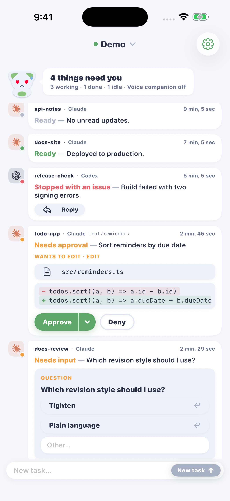
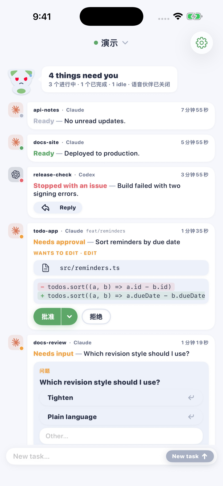
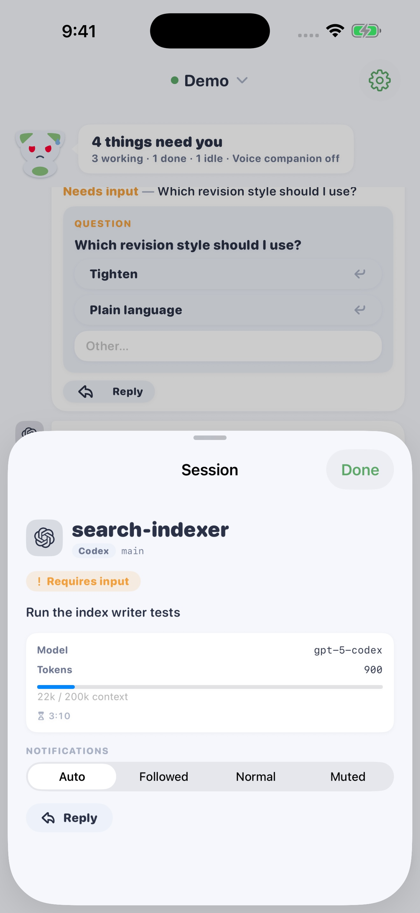
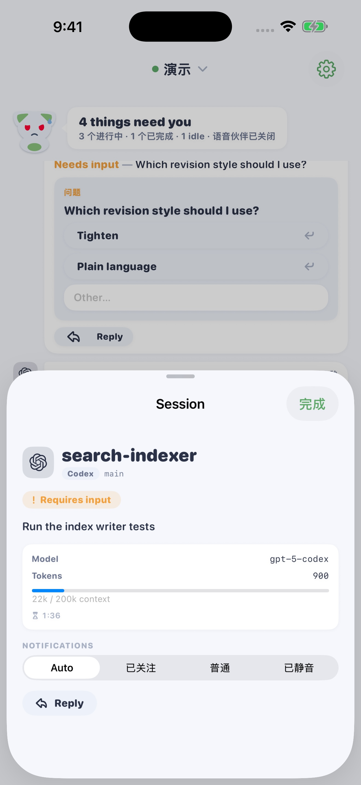
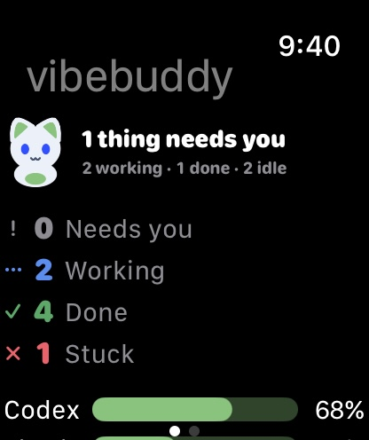
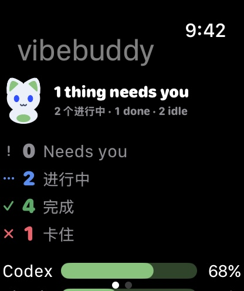
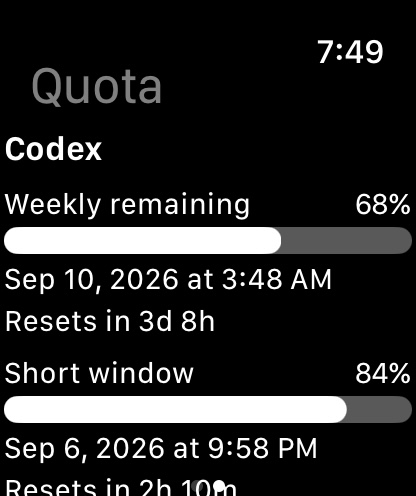
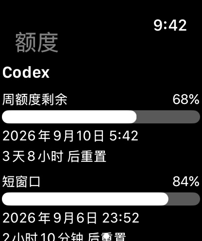
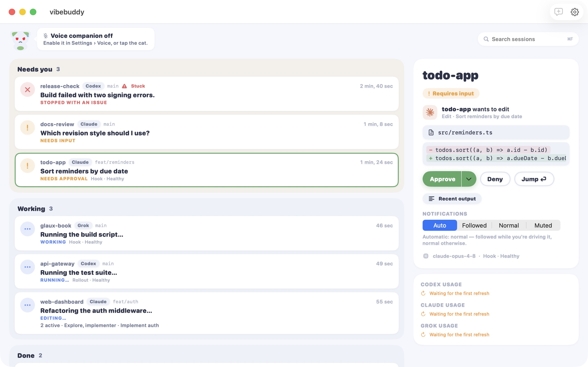
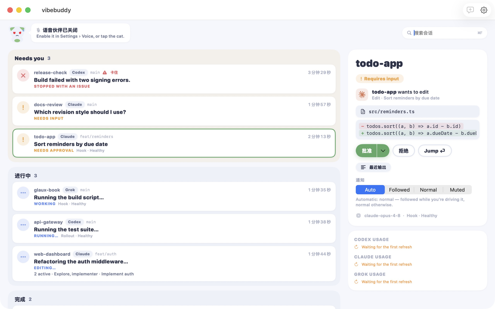

# VibeBuddy 1.3 截图包

2026-09-06 实拍。共 **12 张**：iOS 4 张、watchOS 4 张、macOS 2 张，以及审核配对参考 2 张。全部来自实际运行的 App 演示界面，没有生成或重绘 UI；图片均为 RGB JPEG、无透明通道。文件名数字是各语言内的建议上传顺序。

## 上传位置

| 文件夹 | 每种语言 | 尺寸 | 用途 |
|---|---:|---|---|
| `ios/en-US`、`ios/zh-Hans` | 2 张 | 1320 × 2868 | iPhone 6.9-inch 栏：任务看板、Codex 任务详情 |
| `watchos/en-US`、`watchos/zh-Hans` | 2 张 | 416 × 496 | Apple Watch 栏：任务概览、额度；两种语言尺寸一致 |
| `macos/en-US`、`macos/zh-Hans` | 1 张 | 2560 × 1600 | Mac 平台截图尺寸；当前 Mac 伴侣通过 GitHub 分发，可用于仓库与审核附件。不要上传到 iPhone 截图栏 |
| `reviewer/en-US`、`reviewer/zh-Hans` | 1 张 | 1320 × 2868 | 首次配对及演示入口参考，不作为主宣传截图 |

应用当前 `TARGETED_DEVICE_FAMILY=1`，本包不包含 iPad。截图格式与尺寸依据 [Apple Screenshot specifications](https://developer.apple.com/help/app-store-connect/reference/app-information/screenshot-specifications/) 核对：iPhone 使用受支持的 6.9-inch 尺寸，Mac 为 16:10，Watch 跨语言保持一致。

## 当前素材边界

- **英文版可优先用于预览；中文环境仍有未翻译的产品标签**（例如 “4 things need you”“Requires input”“Model”“Reply”）。样例项目名、代码和模型名也保留英文。图片没有替换这些文字；若发布前完善本地化，应从最终成品重拍。
- Watch 这里拍的是 **App 内任务与额度页面**，不把额度页面称作“表盘小组件截图”。表盘组件配置及实际表盘呈现尚未收录，不应用这组图代替该功能的视觉验收。
- Watch 页面可滚动，额度图展示 Codex 的周窗口和短窗口；下方内容仍在滚动页中。审批页初拍的操作按钮不完整，已从交付包剔除，没有用裁切、拼接或缩小文字伪造完整界面。
- 配对参考页已从最终 1.3(10) 构建重新拍摄，包含 Mac 下载三步引导；它用于帮助定位演示和配对入口，不证明真实 Mac 配对已经验收。
- 演示数据只用于说明界面。任务状态、额度百分比、错误和模型名称均不构成真实 Agent 兼容性、通知送达或额度验证。Mac 演示中的额度区域如实显示等待刷新。
- 8 张宣传截图（iOS 4、watchOS 4）上传状态为 **uploaded**；Mac 与 reviewer 图片未上传。Apple 提交状态单独记录，不以截图上传推定审核通过。最终提交的 build 若改变界面或本地化，应重拍受影响页面。

## 来源与重拍信息

- 移动端全部 10 张（iOS 4、watchOS 4、审核配对参考 2）已从最终 **1.3(10)** 重新采集，来源 HEAD `b3116ef4fa707de0c89a9ccdc24fd0c8e9388737`（产品提交 `f90bef2`）。两张配对参考图重拍后字节与此前图片相同，仍记录为本轮最终构建采集；没有沿用旧移动构建作为来源。
- iOS / Watch：Release 模拟器构建成功，运行时为 iOS / watchOS 26.5；构建参数 `WATCHOS_DEPLOYMENT_TARGET=26.5` 仅适配截图模拟器，未改正式部署目标。这不是 Distribution archive 或最终设备验收。
- 本轮命令（工作目录 `VibeBuddyApp`）：`xcodebuild build -project VibeBuddyApp.xcodeproj -scheme VibeBuddyApp -configuration Release -destination 'generic/platform=iOS Simulator' -derivedDataPath ../build-screenshots -jobs 2 WATCHOS_DEPLOYMENT_TARGET=26.5 CODE_SIGNING_ALLOWED=NO`。
- Mac 两张保持当前发布 **1.3(7)** 的既有真实截图；来自已安装成品的独立副本，bundle ID 为 `com.vibebuddy.store-shots`，本地 ad hoc 签名，仅隔离演示和偏好。Mac 本轮成品未变，不把这两张标为移动 build10 来源或本轮重拍。
- 启动输入：`VIBEBUDDY_DEMO=1`；英文 `-AppleLanguages '(en)' -AppleLocale en_US`；中文 `-AppleLanguages '(zh-Hans)' -AppleLocale zh_CN`。Watch 概览用 `VIBEBUDDY_WATCH_SCENARIO=normal`、`VIBEBUDDY_WATCH_PAGE=home`，额度用 `quota`。交付图使用默认文字大小。
- iPhone 与 Watch 使用隔离截图模拟器并运行本轮最终移动构建。iPhone 状态栏时间固定为 9:41；Watch 模拟器不支持该覆盖，保留系统显示时间。
- 原生采集：`xcrun simctl io <device> screenshot --type=jpeg <path>`；Mac `screencapture -x -o -l <windowID> -t jpg <path>`，1280×800 点窗口得到 2560×1600 像素图片。没有后期缩放、叠字或合成。
- 本轮截图构建成功后，按用户释放磁盘空间的要求清理了专用 `build-screenshots/` 缓存及日志，保留上述可复现命令、最终图片与哈希；正式送审 archive / IPA 保留。Mac 既有采集记录位于 `.scratch/store-shots-1.3/`。
- `manifest.json` 记录每张图片的尺寸、色彩模式、字节数和 SHA-256。

## 预览

### iPhone

| English | 中文环境 |
|---|---|
|  |  |
|  |  |

### Apple Watch

| English | 中文环境 |
|---|---|
|  |  |
|  |  |

### Mac

## 本轮更新（2026-09-06）

全部移动与配对参考截图已从最终 1.3(10) 重新采集；Mac 图片保持当前发布的 1.3(7)。截图不代表真实 Mac 配对、通知送达或手表组件验收通过。8 张宣传截图已上传；两张 reviewer 参考图与两张 Mac 图未上传。截图上传不代表 Apple 审核批准。
